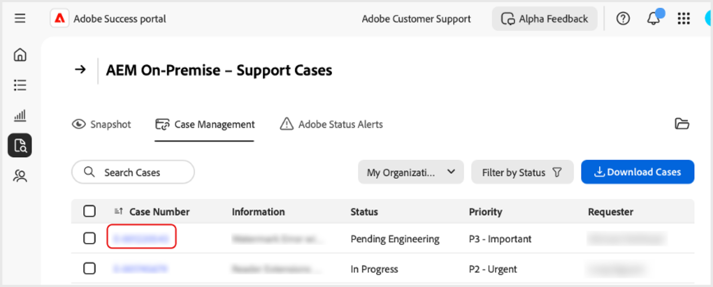

# Cases maken en beheren in de [!DNL Adobe Success]-portal

In deze handleiding wordt uitgelegd hoe u rapporten voor cases in de [!DNL Adobe Success]-portal kunt maken, bekijken en downloaden.

## Een case openen

U kunt een case openen vanuit het tabblad Start of het tabblad **[!UICONTROL Support & Insights]**.

De pagina **[!UICONTROL Open Case]** openen via het tabblad Start:

1. Ga naar het tabblad Start.
1. Selecteer **[!UICONTROL Open Case]**.

   

1. Vul de verplichte velden in:
   1. **[!UICONTROL Select a product]**.
   1. **[!UICONTROL Case Title]**.
   1. **[!UICONTROL Case Description]**.
1. Selecteer **[!UICONTROL Submit Case]**.

   

De pagina **[!UICONTROL Open Case]** openen via het tabblad **[!UICONTROL Support & Insights]**.

1. Ga naar het tabblad **[!UICONTROL Support & Insights]**.
1. Selecteer **[!UICONTROL Open Case]**.

   

Volg dezelfde stappen als hierboven om de case te voltooien en in te dienen.

## Een case bekijken

U kunt een case openen vanuit het tabblad Start of het tabblad **[!UICONTROL Support & Insights]**.

De pagina **[!UICONTROL View Cases]** openen via het tabblad Start:

1. Ga naar het tabblad Start.
1. Selecteer **[!UICONTROL View Cases]**.

   

1. Selecteer de productkaart die u wilt weergeven en kies vervolgens **[!UICONTROL Open Cases]** of **[!UICONTROL Closed Cases]**.

   >[!NOTE]
   >
   >U kunt ook het tabblad **[!UICONTROL Support & Insights]** selecteren om snel productkaarten te openen met de koppelingen voor **[!UICONTROL Open Cases]** of **[!UICONTROL Closed Cases]**.

   

1. Klik op **[!UICONTROL Case Number]** om de details van de case weer te geven.

   

## Caserapporten downloaden

PDF-rapporten over uw cases downloaden:

1. Ga naar het tabblad Start.
1. Selecteer **[!UICONTROL View Cases]**.

   

1. Selecteer de productkaart die u wilt weergeven en kies vervolgens **[!UICONTROL Open Cases]** of **[!UICONTROL Closed Cases]**.

   >[!NOTE]
   >
   >U kunt ook het tabblad **[!UICONTROL Support & Insights]** selecteren om snel toegang te krijgen tot productkaarten met koppelingen naar **[!UICONTROL Open Cases]** of **[!UICONTROL Closed Cases]**.

   

1. Selecteer op de pagina [Product] - Ondersteuningscases het selectievakje naast de case die u wilt downloaden en selecteer **[!UICONTROL Download Cases]**.

   
