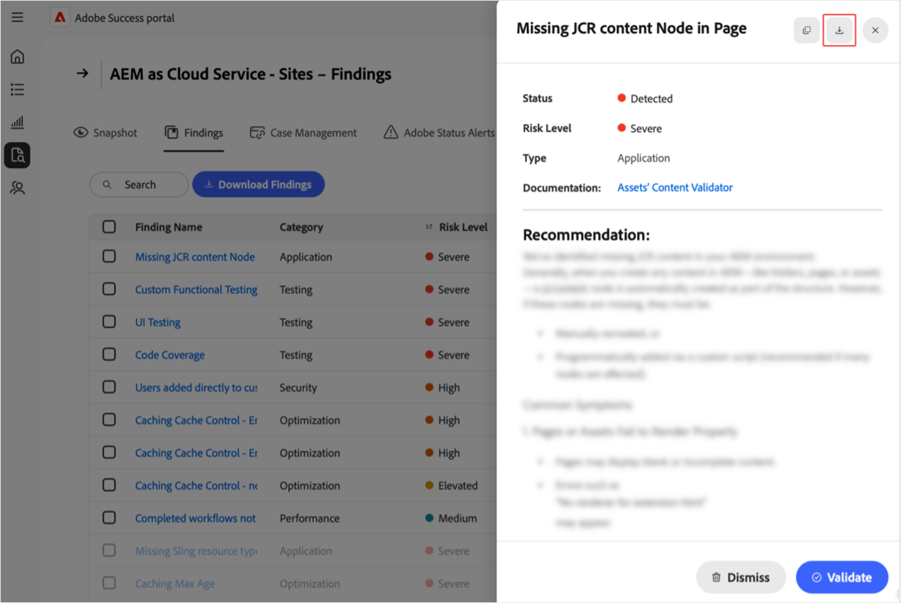

# Bevindingen beheren in de [!DNL Adobe Success]-portal

In deze handleiding wordt uitgelegd hoe u toegang krijgt tot bevindingen in de [!DNL Adobe Success]-portal, hoe u deze kunt interpreteren en hoe u hierop actie kunt ondernemen. Zo helpt u proactief risico&#39;s met betrekking tot productprestaties, beveiliging en functionaliteit te beheren.

Op de pagina [!DNL Adobe Success] portal **[!UICONTROL Findings]** worden de problemen of risico&#39;s weergegeven die zijn gedetecteerd in uw Adobe-productinstantie. De bevindingen omvatten prestaties, veiligheid, en functionaliteit, evenals hun status en risiconiveau. Door deze pagina te controleren, kunt u problemen vroegtijdig aanpakken, voordat ze uw omgeving beïnvloeden.

**Wat zijn bevindingen?**

Bevindingen zijn waarschuwingen over ondersteuningsinzichten die worden weergegeven in de [!DNL Adobe Success]-portal. Ze wijzen op mogelijke problemen in de configuratie van uw Adobe-product, zoals vertraging van de prestaties, beveiligingsrisico&#39;s of onjuiste configuraties. Deze waarschuwingen zijn gebaseerd op telemetriegegevens die zijn verzameld via tools zoals API&#39;s, [!DNL New Relic] en [!DNL Splunk].

**Hoe worden bevindingen gemaakt?**

De teams van Adobe bestuderen regelmatig de meest voorkomende ondersteuningskwesties en trends. Gebaseerd op de inzichten voegen zij nieuwe controles aan het systeem toe. Eenmaal per dag scant de [!DNL Adobe Success]-portal productgegevens om problemen op te sporen, zoals verkeerde configuraties, vastgezette taken of alles wat tot een systeemstoring kan leiden. Als bij een controle iets wordt gevonden dat buiten het veilige bereik valt (zoals gedefinieerd door de product- en ondersteuningsteams van Adobe), wordt dit weergegeven als een bevinding.

**Waarom bevindingen belangrijk zijn**

Door de bevindingen regelmatig te controleren, kunt u problemen in een vroeg stadium opsporen, nog voordat ze uw systeem of klanten beïnvloeden. Deze pro-actieve benadering verbetert systeemstabiliteit, vermindert onderbreking, en ondersteunt best practices.

**Bevindingen oplossen**

Elke bevinding bevat aanbevelingen en duidelijke instructies voor het oplossen van het probleem, samen met koppelingen naar relevante documentatie, indien beschikbaar. Deel deze bevindingen met uw IT-afdeling, engineeringteam of Adobe-partner en werk samen om ze aan te pakken. Als u deze problemen snel verhelpt, voorkomt u grotere problemen en blijft uw systeem probleemloos werken.

## Toegang tot bevindingen

Zo bekijkt u inzichten voor een product:

1. Ga naar **[!UICONTROL Support & Insights]**.
1. Selecteer de relevante productkaart. Selecteer het tabblad **[!UICONTROL Findings]**. 

   

1. U ziet een lijst met alle bevindingen voor het geselecteerde product.

    worden vermeld

1. Vanaf hier kunt u:

    benadrukt

   * Specifieke items zoeken.
   * Exporteer de lijst met bevindingen door **[!UICONTROL Download Findings]** te selecteren. Als u een rapport voor één bevinding wilt exporteren, schakelt u het selectievakje naast de relevante bevinding onder de kolom **[!UICONTROL Finding Name]** in. Als u geen bevinding selecteert, bevat de PDF standaard een lijst met alle bevindingen.
   * Bekijk de details van een bevinding, inclusief een aanbevolen oplossing, door een bevinding te selecteren onder **[!UICONTROL Finding Name]**. Op de detailpagina van de bevinding worden de geselecteerde bevinding weergegeven met aanvullende context en een aanbeveling. Selecteer de downloadpijl om dit rapport weer te geven.

     

## Acties voor bevindingen

Voer de volgende stappen uit om te controleren of elke bevinding nog steeds van toepassing is of kan worden genegeerd.

>[!NOTE]:
>
>De standaardcontroles worden uitgevoerd op uw instanties. Als de controles niet uitwijzen dat het probleem zich in uw instantie voordoet, is de status **[!UICONTROL Not Detected]**.

1. Ga naar **[!UICONTROL Support & Insights]**.
1. Selecteer de relevante productkaart.
1. Open het tabblad **[!UICONTROL Findings]**. Alle bevindingen voor het geselecteerde product worden weergegeven.
1. Selecteer een vermelding onder **[!UICONTROL Finding Name]**. Op de pagina met Bevindingsgegevens kunt u het volgende doen:
   * Selecteer **[!UICONTROL Validate]** om te controleren of het probleem zich blijft voordoen (de knop **[!UICONTROL Validate]** is ontworpen als bevestiging dat het probleem is opgelost):

   

   * Als het probleem zich nog steeds voordoet, wordt het volgende bericht weergegeven: *[!UICONTROL Validation complete. Finding still detected]*. Gebruik de informatie en de aanbeveling op de detailpagina van de bevinding voor onderzoek en probleemoplossing.
   * Als het probleem zich niet langer voordoet, wordt het volgende bericht weergegeven: *[!UICONTROL Validation Complete. Finding no longer detected]*. Als de bevinding niet langer wordt gedetecteerd, wordt de bevinding grijs en verandert de status in **[!UICONTROL Not Detected]**. Bevindingen met de status **[!UICONTROL Not Detected]** bevinden zich onder aan de lijst met bevindingen.
   * Als het probleem niet van toepassing of relevant voor u is, kunt u het negeren door **[!UICONTROL Dismiss]** te selecteren. Als de bevinding wordt afgewezen, wordt de bevinding grijs en verandert de status in **[!UICONTROL Dismissed]**.  Bevindingen met de status **[!UICONTROL Dismissed]** bevinden zich onder aan de lijst met bevindingen.

## Inzicht in bevindingen

* **[!UICONTROL Finding Name]** - Selecteer voor gedetailleerde inzichten en aanbevolen stappen voor probleemoplossing.
* **[!UICONTROL Type]** - Gecategoriseerd als *Functionaliteit*, *Prestatie* en *Veiligheid*.
* **[!UICONTROL Risk Level]** - De ernstindicator, met visuele indicatoren.
* **[!UICONTROL Status]** - De huidige status van de bevinding (bijv. *Gedetecteerd*, *Niet gedetecteerd*, *Afgewezen*).
* **[!UICONTROL Check Last Run]** – Tijdstempel van de laatste controle die de bevinding heeft bijgewerkt.

## Best practices

De pagina **[!UICONTROL Findings]** bevat aanbevelingen met de volgende risiconiveaus: **[!UICONTROL High]**, **[!UICONTROL Elevated]** en **[!UICONTROL Medium]**. **[!UICONTROL High]** is van essentieel belang, **[!UICONTROL Elevated]** is dringend en **[!UICONTROL Medium]** is niet-kritiek. De status en prestaties van de site behouden:

* Reageer direct op de **[!UICONTROL High risk]** bevindingen, omdat deze een ernstige dreiging vormen.
* Los **[!UICONTROL Elevated]** risicoproblemen snel op om escalatie te voorkomen.
* Controleer **[!UICONTROL Medium]** risicobevindingen regelmatig en handel indien nodig.
