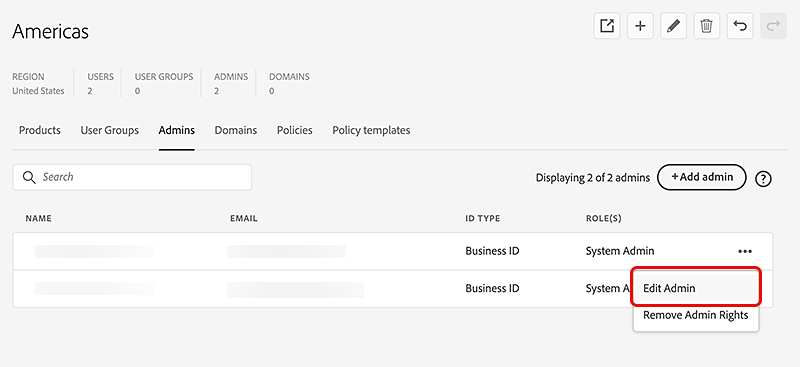

# Beheerders beheren

*is op onderneming van toepassing.*

Onderzoek globale beheerdermogelijkheden en leer hoe te om het beleid van gebruikers, productvergunningen, en groepen te delegeren en te verdelen aan beheerders voor elke individuele organisatie.

In de Global Admin Console kunt u een organisatie selecteren en naar het tabblad **[!UICONTROL Admins]** gaan om beheerdersrechten toe te voegen, te bewerken of te verwijderen. Meer leren, verwijs naar [&#x200B; keurt globaal beleid &#x200B;](https://helpx.adobe.com/nl/enterprise/global-admin-console/adopt-global-administration.html) goed. Ga naar [&#x200B; Global Admin Console &#x200B;](https://global-admin-console.adobe.com/) om binnen te ondertekenen.

De Global Admin Console introduceert een rol die de algemene beheerder wordt genoemd. Deze rol is verschillend van een systeembeheerder en staat u toe om het volgende te doen:

- Bekijk het algemene landschap van uw totale Adobe-investering voor alle Admin Consoles die aan de Global Admin Console-hiërarchie zijn toegevoegd.
- De licentie- en brontoewijzingen van Adobe en het gebruik van meerdere Admin Consoles controleren.
- Maak beheerconsoles of -organisaties.
- Productlicenties toewijzen van een basis- of bovenliggende Admin Console aan onderliggende beheerconsoles die zich onder de hiërarchie bevinden.
- De verrichtingen van dag tot dag handhaven terwijl de systeembeheerders hun eigen Consoles Admin blijven beheren. Een algemene beheerder kan bijvoorbeeld een product toewijzen aan een onderliggend Admin Console, maar niet toewijzen aan gebruikers. De systeembeheerder zal de licenties binnen zijn Admin Console ontvangen en de producten aan de gebruikers toewijzen.
- Pas eventueel organisatiebeleid toe op om het even welke Consoles Admin in de hiërarchie.

## Fundamentele administratieve taken

De Global Admin Console is ontworpen voor samenwerking tussen meerdere organisaties en beheerconsoles. In de volgende tabel worden de verschillende mogelijkheden beschreven en wordt aangegeven waar ze kunnen worden voltooid: Admin Console of Global Admin Console.

<table>
  <tr>
    <th colspan="2">Taak</th>
    <th>Global Admin Console</th>
    <th>Admin Console</th>
  </tr>

<tr>
    <td colspan="2">Onderliggende organisaties maken, weergeven en verwijderen</td>
    <td align="center">Ja</td>
    <td align="center">Nee</td>
  </tr>

<tr>
    <td colspan="2">Werken met meerdere organisaties</td>
    <td align="center">Ja</td>
    <td align="center">Nee</td>
  </tr>

<tr>
    <td rowspan="2" valign="middle">Beheerders beheren</td>
    <td>Voor een of meer organisaties</td>
    <td align="center">Ja</td>
    <td align="center">Nee</td>
  </tr>

<tr>
    <td>Voor één organisatie</td>
    <td align="center">Ja</td>
    <td align="center">Ja</td>
  </tr>

<tr>
    <td colspan="2">Productprofielen en gebruikersgroepen beheren</td>
    <td align="center">Ja</td>
    <td align="center">Ja</td>
  </tr>

<tr>
    <td colspan="2">Beleid definiëren en beheren</td>
    <td align="center">Ja</td>
    <td align="center">Nee</td>
  </tr>

<tr>
    <td colspan="2">Producten toewijzen aan verschillende organisaties</td>
    <td align="center">Ja</td>
    <td align="center">Nee</td>
  </tr>

<tr>
    <td colspan="2">Producten toewijzen aan gebruikers</td>
    <td align="center">Nee</td>
    <td align="center">Ja</td>
  </tr>

<tr>
    <td colspan="2">Gebruikers beheren</td>
    <td align="center">Nee</td>
    <td align="center">Ja</td>
  </tr>

<tr>
    <td colspan="2">Pakketten beheren</td>
    <td align="center">Nee</td>
    <td align="center">Ja</td>
  </tr>

<tr>
    <td colspan="2">Domeinen en mappen instellen</td>
    <td align="center">Nee</td>
    <td align="center">Ja</td>
  </tr>

<tr>
    <td colspan="2">Bedrijfsopslag en -codering beheren</td>
    <td align="center">Nee</td>
    <td align="center">Ja</td>
  </tr>
</table>

## Beheerders beheren

U kunt een flexibele beheershiërarchie maken voor geavanceerd beheer van de toegang tot en het gebruik van Adobe-producten. Net als in de Adobe Admin Console kunt u met de Global Admin Console systeembeheerders, productbeheerders, beheerders van productprofielen, beheerders van gebruikersgroepen, implementatiebeheerders, ondersteuningsbeheerders en opslagbeheerders toevoegen. Deze beheerders kunnen hun respectieve administratieve taken in de organisaties uitvoeren zij de beheerder van zijn. Naast deze rollen zijn er twee nieuwe rollen voor het mondiale beheer: wereldwijd beheer en wereldwijde viewer.

Algemene beheerder is een overgangsrol. Door van een gebruiker de algemene beheerder van een organisatie te maken, wordt die gebruiker automatisch een algemeen beheer van alle kinderen van die organisatie, direct of indirect. Bovendien, als een nieuwe organisatie in de organisatiehiërarchie wordt gecreeerd, zullen alle globale beheerders van om het even welke ouders van die organisatie onmiddellijk globale beheerders van de pas gecreëerde organisatie worden.

Hieronder vindt u de mogelijkheden van de rol Global Admin:

- Onderliggende organisaties maken en verwijderen
- Beleid instellen en bewerken
- Beheerdersrollen instellen en wijzigen
- Producten toevoegen en verwijderen in onderliggende organisaties
- Brontoewijzingen voor onderliggende organisaties instellen of wijzigen
- Productprofielen en gebruikersgroepen beheren

Hieronder vindt u de mogelijkheden van de rol Global Viewer:

- Bekijk de lijst van gebruikersgroepen, producten, productprofielen, beheerders, beleid plaatste, en middelen in de organisatie en in de kindorganisaties.

## Verspreid beheer

Door beheerders te beheren, kan een Globale Admin het beleid van gebruikers, productvergunningen, en groepen delegeren en verdelen aan beheerders voor elke individuele organisatie. De beheerder die door een globale beheerder aan een organisatie wordt toegevoegd, krijgt de flexibiliteit om de organisatie te beheren zonder enige zichtbaarheid in het beheer van andere organisaties. Zo, kan globaal admin beheer van middelen en gebruikers delegeren die de gegevens over die middelen en gebruikers houden geïsoleerd.

Een globale beheerder kan organisaties tot stand brengen, middelen zoals producten en opslag aan die organisaties verdelen, identiteitsopstelling beheren, en organisatiebeleid malplaatjes creëren en toepassen. Een systeembeheerder die door een algemene beheerder aan een organisatie is toegevoegd, kan producten toewijzen aan gebruikers, gebruikers aan boord, productprofielen maken en beheren en andere beheertaken binnen die organisatie uitvoeren.

## Admin toevoegen

1. In [&#x200B; Global Admin Console &#x200B;](https://global-admin-console.adobe.com/), selecteer een organisatie uit te geven, dan aan het **[!UICONTROL Admins]** lusje te navigeren.

1. Selecteer **[!UICONTROL Add Admin]**.

    toe

1. Voer in het dialoogvenster **[!UICONTROL Add Admin]** het volgende in: **[!UICONTROL User Details]** E-mail, Voornaam, Achternaam, Accounttype en Landcode.

   Als u een bestaande gebruiker als beheerder wilt toevoegen, kiest u hetzelfde accounttype als de bestaande gebruiker. Als u dit niet doet, mislukt het toevoegen.

   > [ !NLet op]
   > 
   > Organisaties kunnen beperkingen hebben waaraan accounttypen kunnen worden toegevoegd. Deze kunnen op [&#x200B; beleid &#x200B;](https://helpx.adobe.com/nl/enterprise/global-admin-console/update-policies.html) of op andere configuratieparameters voor een organisatie worden gebaseerd. Het is in organisaties niet toegestaan om zowel Adobe-id-gebruikers als gebruikers van de BusinessID tegelijkertijd toe te voegen. In het algemeen, zouden er geen gebruikers van beide types in een organisatie moeten zijn maar afhankelijk van de orde waarin de regels worden geplaatst kunnen er sommige gebruikers van een bepaald type van Rekening zijn die de toepassing van beleid of regels vooraf gaan.

1. Selecteer een of meer beheerrollen in de sectie **[!UICONTROL Admin Rights]** .

   Voor rollen zoals productbeheerder, de beheerder van het productprofiel, en de beheerder van de gebruikersgroep, selecteer de specifieke producten, de profielen, en de groepen respectievelijk.

    toe

1. Selecteer **[!UICONTROL Save]**.

1. Na het uitgeven van organisaties, uitgezochte **[!UICONTROL Review Pending Changes]**, dan **[!UICONTROL Submit Changes]** om [&#x200B; &#x200B;](https://helpx.adobe.com/nl/enterprise/global-admin-console/execute-jobs.html) de veranderingen uit te voeren.

Wanneer een beheerdersrol wordt toegevoegd, ontvangt de gebruiker een e-mailbericht waarin hij of zij op de hoogte wordt gebracht van de wijziging in zijn of haar rol.

Nadat de beheerder is toegevoegd, ontvangen ze een e-mailbericht waarin ze worden uitgenodigd hun rol te accepteren en hen een koppeling naar de Admin Console te geven. Als ze als globale beheerder en als een andere rol worden toegevoegd, ontvangen ze twee uitnodigingen, een voor de algemene beheerconsole en een voor de Admin Console.

## Een beheerder bewerken

1. Selecteer de organisatie die u wilt bewerken en navigeer naar het tabblad **[!UICONTROL Admins]** .

1. Selecteer het pictogram **[!UICONTROL More Options]** ( ⋮) voor de desbetreffende beheerder en selecteer vervolgens **[!UICONTROL Edit Admin]** .

   

1. Werk de beheergegevens bij en selecteer vervolgens **[!UICONTROL Save]** .

1. Selecteer **[!UICONTROL Review Pending Changes]** nadat u klaar bent met het bewerken van de organisaties.

Voor elke toegevoegde of verwijderde beheerrol wordt een afzonderlijke opdracht weergegeven in de lijst met wijzigingen die in behandeling is. Na het herzien, uitgezocht **[!UICONTROL Submit Changes]** om [&#x200B; uit te voeren &#x200B;](https://helpx.adobe.com/nl/enterprise/global-admin-console/execute-jobs.html) hen.

## Beheerdersrechten verwijderen

1. Selecteer de organisatie die u wilt bewerken en navigeer naar het tabblad **[!UICONTROL Admins]** .

1. Selecteer het pictogram **[!UICONTROL More Options]** ( ⋮) voor de desbetreffende beheerder en selecteer vervolgens **[!UICONTROL Remove Admin Rights]** .

   

1. Selecteer **[!UICONTROL OK]** in het bevestigingsdialoogvenster.

1. Selecteer **[!UICONTROL Review Pending Changes]** nadat u klaar bent met het bewerken van de organisaties. Na het herzien, uitgezocht **[!UICONTROL Submit Changes]** om [&#x200B; uit te voeren &#x200B;](https://helpx.adobe.com/nl/enterprise/global-admin-console/execute-jobs.html) hen.

Nadat u een beheerder hebt verwijderd, ontvangt de gebruiker een e-mailbericht waarin hij of zij wordt geïnformeerd over het verlies van toegang tot de beheerconsole voor die organisatie.

