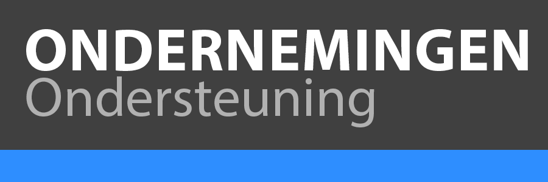

# Enterprise-ondersteuning voor Creative Cloud en Adobe Document Cloud

Adobe biedt een uitgebreide reeks technische bronnen om uw bedrijf te helpen ondersteunen. Deze bronnen maken deel uit van uw Adobe Enterprise-ondersteuning. Dit wordt uitgebreid met het ENTERPRISE-ondersteuningslidmaatschap. ENTERPRISE-klanten kunnen profiteren van onze Named Support Engineer-service. Hierbij werkt een aangewezen technisch contactpersoon in het Adobe-ondersteuningsteam met diepgaande ervaring aan uw oplossing samen met u en uw technische teams om te zorgen voor een tijdige oplossing van alle ondersteuningsverzoeken.

Uw ondersteuningsteam kan u ook helpen bij het coördineren en regelen van de extra ENTERPRISE-voordelen, zodat uw bedrijf op de meest kritieke momenten zo min mogelijk wordt verstoord. Klanten met een ENTERPRISE-ondersteuningslidmaatschap kunnen ook profiteren van onze gedetailleerde en diepgaande technische productdocumentatie en actuele release-opmerkingen.

[PDF-versie weergeven](assets/DMeEnterpriseSupportDatasheet_2022.pdf)

<table>
<thead>
  <tr>
    <th></th>
    <th></th>
    <th>Standaardondersteuning</th>
    <th>Ondersteuning voor bedrijven</th>
  </tr>
</thead>
<tbody>
  <tr>
    <td></td>
    <td></td>
    <td></td>
    <td>Betaalde ondersteuning ($)</td>
  </tr>
  <tr>
    <td rowspan="3">Toegewezen experts </td>
    <td>Account Support Lead</td>
    <td></td>
    <td></td>
  </tr>
  <tr>
    <td>Named Support Engineer</td>
    <td></td>
    <td>✔</td>
  </tr>
  <tr>
    <td>Technisch accountmanager</td>
    <td></td>
    <td></td>
  </tr>
  <tr>
    <td rowspan="17">Ondersteuningsservices</td>
    <td>24x7 ondersteuning voor zelfhulp</td>
    <td>✔</td>
    <td>✔</td>
  </tr>
  <tr>
    <td>24x7 ondersteuning via chat/telefoon</td>
    <td>✔</td>
    <td>✔</td>
  </tr>
  <tr>
    <td>Indienen van webcases</td>
    <td>✔</td>
    <td>✔</td>
  </tr>
  <tr>
    <td>Routering van cases met prioriteit</td>
    <td></td>
    <td>✔</td>
  </tr>
  <tr>
    <td>Versnelde prioritering van problemen</td>
    <td></td>
    <td>✔</td>
  </tr>
  <tr>
  <tr>
    <td>Escalatiebeheer</td>
    <td></td>
    <td>✔</td>
  </tr>
    <td>Proactieve bewaking van cases</td>
    <td></td>
    <td>✔</td>
  </tr>
  <tr>
    <td>Toegang tot regionale ondersteuning</td>
    <td></td>
    <td>✔</td>
  </tr>
  <tr>
    <td>Servicebeoordelingen</td>
    <td></td>
    <td>2/jaar</td>
  </tr>
  <tr>
    <td>Beoordelingen van cases</td>
    <td></td>
    <td>1/maand</td>
  </tr>
  <tr>
    <td>Revisie van oplossing</td>
    <td></td>
    <td></td>
  </tr>
  <tr>
    <td>Revisie van roadmap</td>
    <td></td>
    <td></td>
  </tr>
  <tr>
    <td>Meer Named Support Contacts</td>
    <td></td>
    <td></td>
  </tr>
  <tr>
    <td>Upgrade-/migratieplanning</td>
    <td></td>
    <td></td>
  </tr>
  <tr>
    <td>Voorbereiding en planning van release</td>
    <td></td>
    <td></td>
  </tr>
  <tr>
    <td>Executive Sponsor</td>
    <td></td>
    <td></td>
  </tr>
</tbody>
</table>

## Doelen op serviceniveau: initiële respons

<table>
<thead>
  <tr>
    <th>Prioriteit</th>
    <th>Standaardondersteuning</th>
    <th>Ondersteuning voor bedrijven</th>
    <th>Ondersteuning voor bedrijven</th>
    <th>Ondersteuning voor Elite</th>
  </tr>
</thead>
<tbody>
  <tr>
    <td><strong>PRIORITEIT 1</strong> De productiefuncties van de klant zijn uitgevallen of er is sprake van aanzienlijk gegevensverlies of verslechtering van de service. Er is onmiddellijke aandacht nodig om de functionaliteit en bruikbaarheid te herstellen.</td>
    <td>24x7/ 30 minuten</td>
    <td colspan="3" rowspan="4" align="center">                         Klanten die een ondersteuningslidmaatschap aanschaffen voor toepasselijke Adobe-producten en -services, ontvangen prioriteitsroutering van cases, waardoor cases snel worden doorgestuurd naar de ondersteuningstechnici van Adobe.</td>
  </tr>
  <tr>
    <td><strong>PRIORITEIT 2</strong> De bedrijfsfuncties van de klant ondergaan een aanzienlijke verslechtering van de service of mogelijk gegevensverlies, of een belangrijk onderdeel wordt beïnvloed.</td>
    <td>24x7/ 1 uur</td>
  </tr>
  <tr>
    <td><strong>PRIORITEIT 3</strong> De bedrijfsfuncties van de klant ondergaan een geringe verslechtering van de service, maar er bestaat een oplossing/tijdelijke oplossing waarmee bedrijfsfuncties normaal kunnen worden voortgezet.</td>
    <td>Werkdag/ 4 uur</td>
  </tr>
  <tr>
    <td><strong>PRIORITEIT 4</strong> Algemene vraag met betrekking tot de huidige productfunctionaliteit of een verbeteringsverzoek.</td>
    <td>Werkdag/ 1 dag</td>
  </tr>
</tbody>
</table>

## Functies voor Enterprise-ondersteuning

<table style="table-layout:fixed">
<tr>
  <td>
    
    

    
<b>Named Support Engineer</b>

    
Een aangewezen ondersteuningsingenieur die vertrouwd raakt met uw oplossingsomgeving en bedrijfsdoelstellingen. De NSE is een ervaren ondersteuningstechnicus die u helpt bij het coördineren van uw Enterprise-ondersteuningservaring.

    

  </td>
  <td>
    
    

    
<b>Routering van cases met prioriteit</b>

    
Ontvang geprioriteerde routering voor een snellere verbinding met hogere ondersteuningsbronnen voor ingediende cases.

    

  </td>
  <td>
    
    

    
<b>Escalatiebeheer</b>

    
Een aangewezen contactpunt binnen Adobe dat escalatiehulp en regelmatige updates kan verlenen en kan zorgen voor prioriteit voor uw meest dringende open ondersteuningsverzoeken.

    

  </td>
</tr>
<tr>
  <td>
    
    

    
<b>Versnelde prioritering van problemen</b>

    
Ontvang hogere prioriteit bij het verwerken van ondersteuningscases dankzij een gefaciliteerde samenwerking met Engineering.

    

  </td>
  <td>
    
    

    
<b>Proactieve bewaking van cases</b>

    
Een aangewezen contactpersoon binnen Adobe zal openstaande cases actief volgen en proactieve en preventieve maatregelen nemen om tijdige afwikkeling te waarborgen.

    

  </td>
  <td>
    
    

    
<b>Beoordelingen van cases</b>

    
Regelmatig geplande evaluaties van openstaande ondersteuningsverzoeken, waardoor de klant op één lijn komt met de casebeschrijving, de zakelijke impact, de status, de prioriteit en overeenstemming over de volgende stappen die nodig zijn om een tijdige oplossing te garanderen.

    

  </td>
</tr>
<tr>
  <td>
    
    

    
<b>Servicebeoordelingen</b>

    
Uitgebreide halfjaarlijkse evaluatie van de services, voordelen en prestaties van het Enterprise-programma. Dit kan worden gecombineerd met andere strategische bedrijfsevaluaties die met Adobe worden gehouden.

    

  </td>
  <td>
    
    

    
<b>Toegang tot regionale ondersteuning</b>

    
Ontvang ondersteuning van leden van ons Adobe-ondersteuningsteam in uw regio. Dit kan ondersteuning in uw land en/of taal omvatten.

    

  </td>
</tr>
</table>

## Functies van Standard-ondersteuning

<table style="table-layout:fixed">
<tr>
  <td>
    
    

    
<b>Communityforums</b>

    
Doorlopend online toegang tot een groeiende database met technische oplossingen, productdocumentatie, veelgestelde vragen en meer. Kom in contact met professionals en andere klanten in de Adobe-community om best practices en geleerde lessen te delen.

    

  </td>
  <td>
    
    

    
<b>Zelfhulpportal</b>

    
On-demand toegang tot de online zelfhulp-ondersteuningsportal om ondersteuningsverzoeken in te dienen, de status van aanvragen te bekijken en door andere bronnen te bladeren, zoals onze kennisbank, nieuws en waarschuwingen, aanbevolen tips en meer.

    

  </td>
  <td>
    
    

    
<b>Ondersteuning via chat</b>

    
Geautoriseerde gebruikers (beheerders) kunnen een chatsessie starten met Adobe-ondersteuning om antwoorden en hulp te krijgen bij het indienen van cases

    
<i>Afhankelijk van lokale tijden.</i>

    

  </td>
</tr>
<tr>
  <td>
    
    

    
<b>Telefonische ondersteuning</b>

    
Geautoriseerde gebruikers (beheerders) kunnen Adobe-ondersteuning bellen voor antwoorden en hulp bij het indienen van cases.

    
<i>Afhankelijk van lokale tijden.</i>

    

  </td>
  <td>
    
    

    
<b>Webcase indienen</b>

    
Geautoriseerde gebruikers (beheerders) kunnen op elk gewenst moment onbeperkte webcases indienen voor ondersteuningsproblemen die door ons team voor technische ondersteuning kunnen worden beoordeeld.

    

  </td>
</tr>
</table>

## Bronnen

| Bron | Beschrijving |
|--- |--- |
| [Enterprise Learn en ondersteuning](https://helpx.adobe.com/enterprise.html) | Enterprise Learn en ondersteuning is een plek waar Adobe-klanten zelfhulptutorials, productdocumentatie, training onder leiding van een instructeur, community en ondersteuning voor bepaalde Adobe Creative Cloud- en Document-producten kunnen vinden. |
| [Adobe-ondersteuningscommunity](https://community.adobe.com/) | De Adobe-ondersteuningscommunity is de plaats om vragen te stellen, antwoorden te vinden, van experts te leren en uw kennis te delen. |
| [Productieproblemen en systeemuitval](https://status.adobe.com/) | Status.adobe.com geeft de statusinformatie weer van alle Adobe-producten en -services die worden geïmplementeerd in omgevingen met meerdere tenants. Klanten kunnen lidmaatschapsvoorkeuren kiezen om e-mailmeldingen te ontvangen wanneer Adobe een productgebeurtenis maakt, bijwerkt of oplost. Voorbeelden zijn gepland onderhoud of serviceproblemen van verschillende ernst. |
| [Voorwaarden en bepalingen](https://helpx.adobe.com/support/programs/support-policies-terms-conditions.html) | Voorwaarden en bepalingen voor het aanbod van ondersteuningsservices. |

{style="table-layout:auto"}

## Regionaal bereik van Adobe-ondersteuning, lokale openingstijden en taalondersteuning

De lokale kantooruren van Adobe zijn afgestemd op de factureringsregio van de klant.

<table>
<thead>
  <tr>
    <th>Amerika1</th>
    <th>Europa, Midden-Oosten en Afrika</th>
    <th>Azië, Stille Oceaan</th>
    <th>Japan</th>
  </tr>
</thead>
<tbody>
  <tr>
    <td>24x7</td>
    <td>9:00 - 17:00 uur</td>
    <td>9:00 - 17:00 uur</td>
    <td>09:00 -  17:30 uur</td>
  </tr>
  <tr>
    <td colspan="4">
      
1Ondersteuning voor Amerika is alleen beschikbaar in het Engels.

    </td>
  </tr>
</tbody>
</table>

*Neem contact op met uw Named Account Manager (NAM) of Customer Success Manager (CSM) voor meer informatie over aanbiedingen voor ondersteuning van Adobe en uw juiste niveau.*
