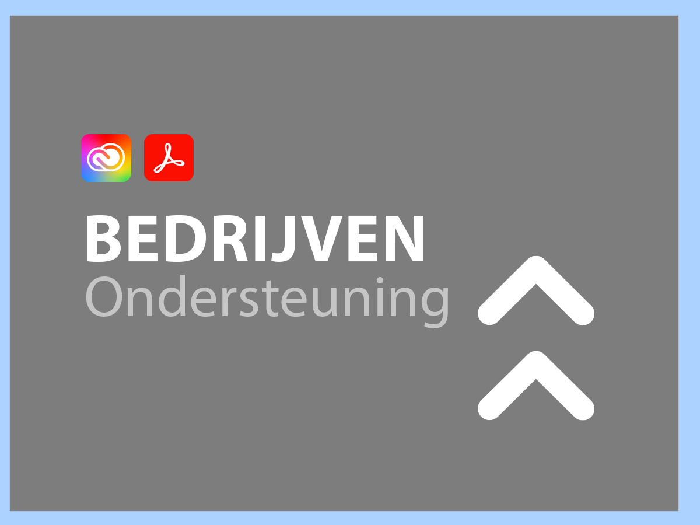
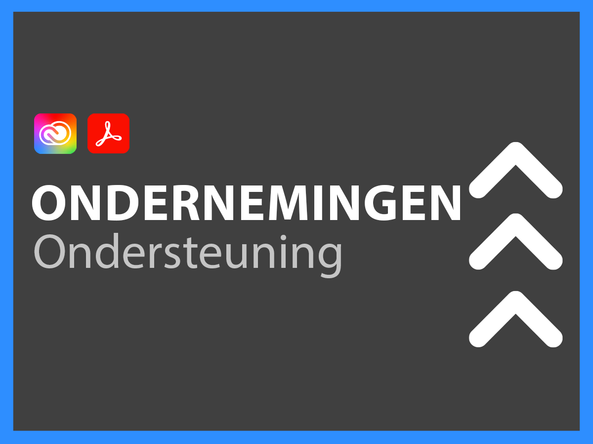
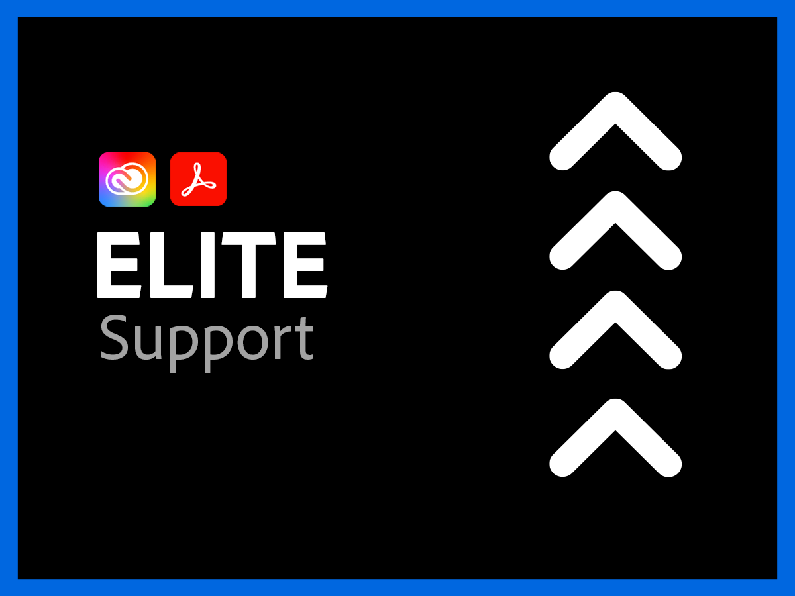

# Ondersteuningsservices voor Creative Cloud Enterprise en Document Cloud

Adobe Creative Cloud en de organisatie van de klantenondersteuning van Document Cloud zijn geëngageerd aan uw succes. Alle toepassingen beschikken over een supportniveau dat eenvoudig toegang biedt tot onze hooggekwalificeerde technische middelen voor technische ondersteuning.

Voor uitgebreidere behoeften bieden we Adobe Support-plannen die toegang tot benoemde supportprofessionals en sessies voor proactieve mentoring en servicecontroles bevatten. Hoe complex uw supportbehoeften ook zijn, Adobe biedt de technische en operationele expertise die nodig is om u te helpen maximale prestaties en optimale waarde te behalen met uw Adobe-toepassingen.

<table style="table-layout:fixed">
<tr>
  <td>
    
    

    <a href="dme-standard.md"><strong>Standaardondersteuning</strong></a> (weergave <a href="assets/DMeStandardSupportDatasheet_2022.pdf" target="_blank">PDF</a>)
    

    
24x7 toegang voor Erkende Gebruikers (Admins) tot onze technische ondersteuningsteams via chat of telefoon en de mogelijkheid om verzoeken om hulp via ons ondersteunings-webportaal in te dienen. 

     
  </td>
  <td>
    
    

    <a href="dme-business.md"><strong>Business Support</strong></a> (weergave <a href="assets/DMeBusinessSupportDatasheet_2022.pdf" target="_blank">PDF</a>)
    

    
Prioriteit die voor steungevallen verplettert om snellere verbinding aan hogere steun en de capaciteit te verzekeren om een Lood van de Steun van de Rekening te hefboomwerking om regelmatige mededelingen en updates voor uw meest kritieke van steunverzoeken te ontvangen.

     
  </td>
</tr>
<tr>
  <td>
    
    

    <a href="dme-enterprise.md"><strong>Enterprise-ondersteuning</strong></a> (weergave <a href="assets/DMeEnterpriseSupportDatasheet_2022.pdf" target="_blank">PDF</a>)
    

    
De aangewezen technische contact in het Team van de Steun van de Adobe met diepe ervaring in uw oplossing zal in partnerschap met u en uw technische teams werken om geschikte oplossing van alle steunverzoeken te verzekeren.

     
  </td>
  <td>
    
    

    <a href="dme-elite.md"><strong>Elite-ondersteuning</strong></a> (weergave <a href="assets/DMeEliteSupportDatasheet_2022.pdf" target="_blank">PDF</a>)
    

    
Aangewezen technisch contact in het team van de Steun van de Adobe en een Technische Manager van de Rekening die in partnerschap met u werkt om beste-in-klasse pro-actieve steun te verlenen om u te verzekeren maximaliseert uw investering en u te helpen problemen vermijden alvorens zij gebeuren.

     
  </td>
</tr>
</table>

