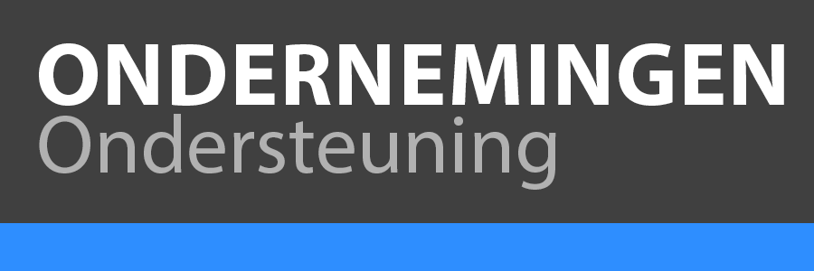

# Enterprise-ondersteuning

Adobe Experience Cloud Enterprise Support Services biedt uitgebreide doelstellingen voor serviceniveau (SLT&#39;s), voordelen van technische expertise en een advocaat in de vorm van een Benoemde supporttechnicus.

<table>
<thead>
  <tr>
    <th></th>
    <th></th>
    <th>Online ondersteuning</th>
    <th>Enterprise-ondersteuning</th>
  </tr>
</thead>
<tbody>
  <tr>
    <td></td>
    <td></td>
    <td></td>
    <td>Betaalde ondersteuning ($)</td>
  </tr>
  <tr>
    <td rowspan="3">Toegewezen experts </td>
    <td>Hoofd accountondersteuning</td>
    <td></td>
    <td></td>
  </tr>
  <tr>
    <td>Benoemde supporttechnicus</td>
    <td></td>
    <td>✔</td>
  </tr>
  <tr>
    <td>Technisch accountmanager</td>
    <td></td>
    <td></td>
  </tr>
  <tr>
    <td rowspan="12">Ondersteuningsservices</td>
    <td>Online ondersteuning</td>
    <td>Zakelijke uren</td>
    <td>24x5</td>
  </tr>
  <tr>
    <td>24x7x365 P1 Issue Support</td>
    <td>✔</td>
    <td>✔</td>
  </tr>
  <tr>
    <td>Contacten voor benoemde ondersteuning (per product)</td>
    <td>4</td>
    <td>10</td>
  </tr>
  <tr>
    <td>Live telefonische ondersteuning</td>
    <td></td>
    <td>✔</td>
  </tr>
  <tr>
    <td>Escalatiebeheer</td>
    <td></td>
    <td>✔</td>
  </tr>
  <tr>
    <td>Servicebeoordelingen per jaar</td>
    <td></td>
    <td>2</td>
  </tr>
  <tr>
    <td>Professionele sessies per jaar</td>
    <td></td>
    <td>2</td>
  </tr>
  <tr>
    <td>Beoordelingen van kwesties</td>
    <td></td>
    <td>✔</td>
  </tr>
  <tr>
    <td>Gebeurtenisbeheer</td>
    <td></td>
    <td></td>
  </tr>
  <tr>
    <td>Omgevingsrevisie, onderhoud en bewaking</td>
    <td></td>
    <td></td>
  </tr>
  <tr>
    <td>Release, migratie, upgrade en evaluatie van productroutekaart</td>
    <td></td>
    <td></td>
  </tr>
  <tr>
    <td>Ondersteuningsactiviteiten voor cloud - Experience Managers als cloud</td>
    <td></td>
    <td>✔</td>
  </tr>
  <tr>
    <td rowspan="2">Veldservices</td>
    <td>Beginnen met adviesservices - Eerste jaar van nieuwe oplossing</td>
    <td></td>
    <td>✔</td>
  </tr>
  <tr>
    <td>Veldserviceactiviteiten</td>
    <td></td>
    <td>✔</td>
  </tr>
</tbody>
</table>

## Doelen op serviceniveau: Eerste reactie

| Prioriteit | Online ondersteuning | Enterprise-ondersteuning |
|--- |--- |--- |
| <b>PRIORITEIT 1</b> De bedrijfsfuncties van de klant op het gebied van de productie zijn onderdrukt of hebben een aanzienlijk gegevensverlies of een verslechtering van de services en er is onmiddellijke aandacht nodig om de functionaliteit en bruikbaarheid te herstellen. | 24x7/ 1 uur | 24x7/ 30 minuten |
| <b>PRIORITEIT 2</b> De bedrijfsfuncties van de Klant hebben een aanzienlijke verslechtering van de diensten, of potentieel van gegevensverlies of onbeschikbaarheid van de diensten, of een belangrijke eigenschap wordt beïnvloed. | Bedrijfsuren/ 4 uur | 24x5/ 1 uur |
| <b>PRIORITEIT 3</b> De bedrijfsfuncties van de Klant hebben een lichte tot geen verslechtering van de diensten met een oplossing/een oplossing die bedrijfsfuncties toestaat om verder te gaan. | Bedrijfsuren/ 6 uur | Zakelijke uren/  2 uur |
| <b>PRIORITEIT 4</b> Algemene vraag met betrekking tot de huidige productfunctionaliteit of een verbeteringsverzoek. | Zakelijke dagen/ 3 dagen | Zakelijke dag/ 1 dag |

{style=&quot;table-layout:auto&quot;}

## Functies voor Enterprise-ondersteuning

<table style="table-layout:fixed">
<tr>
  <td>
    
    

    
<b>Beoordelingen van kwesties</b>

    
Regelmatige geplande evaluatie van open supportverzoeken, waarbij de klant zich moet richten op de beschrijving van de zaak, het effect op het bedrijf, de status, de prioriteit en de overeenstemming over de volgende stappen die nodig zijn om een snelle oplossing te garanderen.

    

  </td>
  <td>
    
    

    
<b>Benoemde supporttechnicus</b>

    
Een aangewezen steuningenieur die met uw oplossingsmilieu en bedrijfsdoelstellingen vertrouwd wordt. De NSE is een ervaren supporttechnicus die u helpt uw Enterprise Support-ervaring te coördineren.

    

  </td>
  <td>
    
    

    
<b>Professionele sessies</b>

    
Een sessie van 60 minuten die zich richt op een specifieke productfunctie en hoe deze kan worden gebruikt om algemene bedrijfsproblemen op te lossen.

    

  </td>
</tr>
<tr>
  <td>
    
    

    
<b>Escalatiebeheer</b>

    
Een aangewezen contactpunt binnen Adobe dat escalatiehulp, regelmatige updates kan verlenen en ervoor zorgt dat prioriteit wordt gegeven aan uw meest kritieke open steunverzoeken.

    

  </td>
  <td>
    
    

    
<b>Servicebeoordelingen</b>

    
Een halfjaarlijkse uitgebreide evaluatie van de services, voordelen en ondersteuningscijfers van het Adobe Enterprise-programma.

    

  </td>
  <td>
  </td>
</tr>
</table>

## Ondersteuningsactiviteiten voor cloud - AEM

<table style="table-layout:fixed">
<tr>
  <td>
    

    
<b>Bestuur voor AEM als Cloud Service</b>

    
Technisch en operationeel bestuur om AEM als Cloud Service klanten te helpen zich aan industriestandaarden en beste praktijken voor AEM als Cloud Service te houden.

    

  </td>
  <td>
    

    
<b>Services met toegevoegde waarde voor AEM als Cloud Service</b>

    
Identificeer, herzie en verstrek aanbevelingen over aangepaste oplossingsadoptiegebieden die mogelijkheden voor optimalisering hebben.

    

  </td>
  <td>
    

    
<b>Aanpassingsbeste praktijken voor AEM als Cloud Service</b>

    
Aanpassing van best practices en kerncomponenten op AEM als Cloud Service stimuleren.

    

  </td>
</tr>
</table>

## Online ondersteuningsfuncties

<!--
Adobe Customer Support offers access to online resources for documentation, engagement with other experts and customers for best practices, and webinar series (Office Hours) for troubleshooting tips and tricks. Several channels are also available for questions and case submissions.
-->

<table style="table-layout:fixed">
<tr>
  <td>
    
    

    
Communityforums

    
<b>Onlineforums</b>

    
Doorlopende online toegang tot een groeiende database met technische oplossingen, productdocumentatie, veelgestelde vragen en meer. Verbind met artsen en andere klanten op de Gemeenschap van Adobe om beste praktijken en geleerde lessen te delen.

    

  </td>
  <td>
    
    

    
24x7x365 P1

    
<b>Telefonische ondersteuning</b>

    
Geautoriseerde gebruikers of Contacten voor benoemde ondersteuning kunnen via alle beschikbare kanalen problemen indienen (waaronder telefoon voor P1) en namens uw bedrijf communiceren met ons team voor technische ondersteuning.

    

  </td>
  <td>
    
    

    
Experience League

    
<b>Zelfgeleide reizen</b>

    
De Makers van de ervaring worden gemaakt met Experience League. Klanten kunnen hun mogelijkheden van het Beheer van de Ervaring van de Klant met gepersonaliseerde het leren beginnen om vaardigheden te ontwikkelen, met een mondiale gemeenschap van edelen in dienst te nemen, en loopbaanbevordering erkenning te verdienen.

    

  </td>
</tr>
<tr>
  <td>
    
    

    
Kantooruren

    
<b>Webinars</b>

    
Office Hours is een initiatief van het klantenondersteuningsteam van Adobe. Deze sessies zijn ontworpen om deelnemers te informeren en te helpen problemen op te lossen en tips en trucs te bieden om met Adobe Experience Cloud succesvol te zijn.

    

  </td>
  <td>
    
    

    
Live Chatondersteuning *

    
<b>Chatondersteuning</b>

    
Begin een praatjezitting om antwoorden &amp; hulp bij het voorleggen van gevallen te krijgen.

    
* <i>Niet alle producten hebben live chatondersteuning.</i>

    

  </td>
  <td>
    
    

    
Zelfhulpportalen

    
<b>24x7 ondersteuningsportaal</b>

    
Toegang op aanvraag tot het online portal voor zelfondersteuning om ondersteuningsverzoeken in te dienen, de status van een geval te bekijken en door andere bronnen te bladeren, zoals onze knowledgebase, nieuws en waarschuwingen, aanbevolen tips en nog veel meer.

    

  </td>
</tr>
</table>

## Advies starten

Voor klanten die een **nieuwe Adobe Experience Cloud oplossing** uitvoeren, is het Adviseren van de Lancering een *kernreeks van adviesdiensten* en aanbevelingen die worden bewezen om succesvolle plaatsingen te steunen en tijd-aan-waarde te versnellen.

<!--

-->

De de oplossingsdeskundigen van de Adobe helpen vereisten, architectuur, ontwikkelingsproces bevestigen, en lanceringsoverzichten met beste op praktijk-gebaseerde begeleiding aan klanten en implementatiepartners.

De Advisering van de lancering zal zich op uw projectprogramma door gemeenschappelijke mijlpalen (Kickoff, Bepaal, Ontwerp, Go-live en de Lancering van de Post) richten om te begeleiden, te bevestigen, te beoordelen en aanbevelingen te doen. Belangrijkste te leveren items zijn:

* Kickoff (met inbegrip van het plan van de projectsamenwerking) dek
* Beoordelingsdocumenten en aanbevelingen
* Overzicht van betrokkenheid

<!--

-->

## Veldserviceactiviteiten

De Diensten van het gebied worden gebruikt voor **snelle resolutie**, gericht klantsucces en versnelde **tijd-aan-waarde**. Als het advies van de Lancering actief is zal er **geen Diensten van het Gebied in jaar 1** voor om het even welk oplossingsproduct zijn dat door een contract van de Steun van de Adobe wordt behandeld.

Als Enterprise-klant komt u in aanmerking voor **2 activiteiten per jaar** vanuit de volgende twee tracks: **Technisch** en/of **Strategisch**.

**Met de technische** trackactiviteiten wordt ervoor gezorgd dat klanten technisch gezond zijn en hun gereedschapsacceptatie maximaliseren. Specifiek, omvatten deze soorten activiteiten steun en aanbevelingen met betrekking tot platformconfiguraties, integratie en het oplossen van problemen.

Beschikbare soorten technische activiteiten:

* Gezondheidscontrole
* Platform
* Inschakelen van functieset
* Basisintegratie en -configuraties
* Oplossingen voor klanten
* Ondersteuning voor cloudservice

**De strategische** Acties van het Spoor bepalen kansen om ervoor te zorgen dat de waarde van de oplossingen van de Adobe van een klant wordt gerealiseerd. Deze omvatten supportaanbevelingen met betrekking tot strategie, meting en rijpheid om de realisatie van waarden over een of meer Adobe-oplossingen te stimuleren.

Beschikbare soorten strategische activiteiten:

* Routekaart voor looptijd
* Ontwikkeling/meting van hoofdletters gebruiken
* Rapportage en analyse
* Inschakelen van tips en trucs

## Bronnen

| Resource | Beschrijving |
|--- |--- |
| [Experience League](https://experienceleague.adobe.com/) | Experience League is hoe Adobe bedrijven helpt de waarde te bereiken die ze van hun Adobe-investering verwachten. Het is de verenigde plaats waar de klanten kunnen leren, verbinden, en groeien langs een gepersonaliseerde weg aan succes dat zelfhulpleerprogramma&#39;s, productdocumentatie, instructeur-geleide opleiding, gemeenschap en technische steun omvat. |
| [Training](https://training.adobe.com/training/) | Adobe Digital Learning Services-cursussen zijn toegankelijk vanuit Experience League. De leercursussen integreren zowel op bestelling als instructeur-geleide lessen. Hier kunt u vaardigheden opdoen die erkende marktwaarde hebben en hen plaatsen om succes in uw organisaties te drijven. |
| [Productieproblemen en systeemstoringen](https://status.adobe.com/) | Status.adobe.com brengt de gezondheidsinformatie van alle producten en de diensten van de Adobe over die in multi-huurdersomgevingen worden opgesteld. Klanten kunnen hun abonnementsvoorkeuren kiezen om e-mailberichten op te halen wanneer Adobe een productgebeurtenis maakt, bijwerkt of oplost. Dit kan het geplande onderhoud of de dienstkwesties van verschillende niveaus van strengheid omvatten. |
| [Voorwaarden en bepalingen](https://helpx.adobe.com/support/programs/support-policies-terms-conditions.html) | Voorwaarden en bepalingen met betrekking tot het aanbod van de Diensten van de Steun. |

## Regionaal bereik van de ondersteuning van Adobe, lokale bedrijfsuren en taalondersteuning

Het regionale toepassingsgebied van de Steun van de Adobe wordt gevestigd door het het facturerings adres van de klant (via de het koopdocument van de Orde van de Verkoop of andere Adobe van de Steun) aan één van de volgende regio&#39;s aan te passen:

<table>
<thead>
  <tr>
    <th>Amerika</th>
    <th>Europa, Midden-Oosten en Afrika</th>
    <th>Azië, Stille Oceaan</th>
    <th>Japan1</th>
  </tr>
</thead>
<tbody>
  <tr>
    <td>18:30</td>
    <td>20:09</td>
    <td>20:09</td>
    <td>21:05</td>
  </tr>
  <tr>
    <td colspan="4">
      
1<i>Taalondersteuning is alleen beschikbaar in het Engels en Japans.</i>

      
<i>Bij Adobe Commerce wordt ondersteuning van Japanse talen uitgesloten.</i>

      
<i>P2, P3, P4 gevallen zijn beperkt tot kantooruren alleen in Japan.</i>

    </td>
  </tr>
</tbody>
</table>

