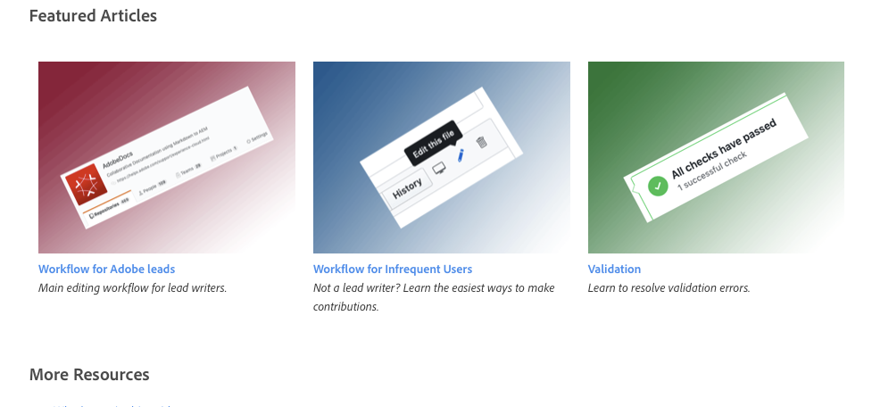

# Handleiding voor syntaxisstijl voor opmaak

Deze pagina illustreert de onderdrukkingscomponent voor Digital Experience Technical Documentation Authoring aan de hand van de opmaak .md (markdown). Deze pagina bevat gegevens voor medewerkers van Adoben.

EDS

Zie hier: [ Adobe.com ](https://www.adobe.com){rel=nofollow}

<!--
* You can [view a basic sample file](sample.md) or [view a sample file with advanced syntax examples](sample-full.md)
-->

>[!TIP]
>
>Bekijk deze [ video van de Prijsverlaging van AdobeDocs ](https://video.tv.adobe.com/v/26165).

Voor het grootste deel, volgen wij standaard git-gearomatiseerde prijsingssyntaxis (GFM) voor het formatteren van tekst. Nochtans, wordt sommige syntaxis (zoals horizontale lijnen) niet gesteund, en wij hebben Markdown op een aantal manieren uitgebreid om onze documentatiebehoeften aan te passen.

## Basistekstopmaak

Een alinea vereist geen speciale syntaxis in Markdown. Voeg een lege regel toe tussen elke alinea.

Om tekst als **vette letters** te formatteren, sluit u het in twee asterisks in:

```
This text is **bold**.
```

Om tekst als *cursief* te formatteren, sluit u het in één enkele asterisk in:

```
This text is *italic*.
```

Om tekst als zowel ***vette als cursieve*** te formatteren, sluit u het in drie asterisken in:

```
This is text is both ***bold and italic***.
```

Als u opmaaktekens voor markeringen wilt negeren, gebruikt u `\` voor het teken:

`This is not \*italicized\* type.`

Gerenderd: dit type is niet \*cursief\*.

## Badges

In uitvoering. Wachten op loc.

<!--

See the [dev version of this article](https://experienceleague-dev.corp.adobe.com/docs/authoring-guide-exl/using/markdown/syntax-style-guide.html#badges) for an example. Or [this one](https://experienceleague-dev.corp.adobe.com/docs/internal-test/test/badge.html).

There are two ways to create badges:

* **Metadata badge** - Specify the badge information in metadata so that the badge appears above the title in the article. This is especially useful for adding a badge to all articles in a guide or repo via the TOC.md or metadata.me files.
* **Inline badge** - Specify the badge information on its own line or in a heading, table, or other page element.


**Badge syntax**

*Metadata*: `badge: "Beta Content" type="Informative" url="https://www.example.com" tooltip="Go to example.com"`

*Inline*: `[!BADGE Beta Content]{type=Informative url="https://www.example.com" tooltip="Go to example.com"}`

**Examples**

```
|Type|Badge|
|---|---|
|Informative (default)|[!BADGE Beta]{type=Informative url="https://www.example.com"}|
|Positive|[!BADGE New Feature]{type=Positive url="https://www.example.com" tooltip="Go to example.com"}|
|Negative|[!BADGE Discontinued]{type=negative tooltip="This feature is now end of life"}|
|Neutral|[!BADGE Maybe]{type=Neutral tooltip="A rider fell off his horse..."}|
|Caution|[!BADGE Attention]{type=Caution tooltip="Yellow status"}|
```

**Rendered**

|Type|Badge|
|---|---|
|Informative (default)|[!BADGE Beta]{type=Informative url="https://www.example.com"}|
|Positive|[!BADGE New Feature]{type=Positive url="https://www.example.com" tooltip="Go to example.com"}|
|Negative|[!BADGE Discontinued]{type=negative tooltip="This feature is now end of life"}|
|Neutral|[!BADGE Maybe]{type=Neutral tooltip="A rider fell off his horse..."}|
|Caution|[!BADGE Attention]{type=Caution tooltip="Yellow status"}|

**More details**

* Only the badge label is required. The `type`, `url`, and `tooltip` parameters are optional. The `type` parameter determines the color. The `url` parameter lets users click the badge to open an article. The `tooltip` parameter displays the tooltip text on mouseover.
* If you want multiple badges to appear at the top of the page, use different badge names. For example, you can create badge names such as `badgeBeta` or `badgeWeb`. Example:

  ```
  badge1: "Beta"
  badge2: "Campaign Web"
  ```

* For metadata badges, make sure that all values are wrapped in quotes. For inline badges, make sure that `url` and `tooltip` are wrapped in quotes.
* Valid type values include *Informative* (default, blue), *Positive* (green), *Negative* (red), *Neutral* (dark gray), and *Caution* (yellow). 

-->

## Blokkeringen

Ons ontwerpsysteem gebruikt blockquotes (`>` aan het begin van lijnen) om de uitbreidingen van de douanemarkering voor uiteinden, nota&#39;s, en video&#39;s te identificeren. U kunt daadwerkelijke blockquotes tot stand brengen door een `>` karakter vóór een paragraaf toe te voegen.

>Dit is een blockquote.

```
>This is a blockquote quotation.
```

## Codeblok (op regel){#code-block}

**Wanneer te gebruiken**

Wordt gebruikt om een stukje code in een zin online weer te geven. Ideaal om een cookie-naam, bestandsnaam, waarde of opdracht op te roepen waarvoor geen codeblok met volledige omtrek vereist is.

Inhoud binnen codeblokken in rendering as is and not localized. (De enige uitzondering op deze regel zijn `` en `` syntaxis, die worden verwijderd tijdens het maken van het pakket voor publicatie.)

Gebruik ook codeblokken voor voorbeeld-URL&#39;s die niet moeten worden gevalideerd: `https://www.example.com`

**Syntaxis**

Een codeblok gebruikt één enkele backticks om het code-element te omsluiten u zou willen benadrukken.

```
This is `inline code` within a paragraph of text.
```

**Voorbeeld**

Dit is `inline code` in een alinea met tekst.

>[!TIP]
>
>U kunt tekst ook tussen drie streepjes plaatsen (&grave;&grave;&grave;) om een inline-codeblok te maken. Dit is vooral nuttig wanneer u een achtertikteken binnen een gealigneerd codeblok moet van verwijzingen voorzien. Voorbeeld:
>
>&grave;&grave;&grave;`Use a back tick (`&grave;`) for formatting`&grave;&grave;&grave;&grave;

## Codeblok (afgezonderd)

**Wanneer te gebruiken**

Gebruik een codeblok om de syntaxis van de code weer te geven. Een omheind codeblok gebruikt drie keer de achtergronden om het code-element dat u wilt markeren, te omsluiten. Voeg lege regels toe boven en onder het omheinde codeblok.

Codeblokken zijn niet gelokaliseerd.

>[!TIP]
>
>Geef een taal op wanneer u een omheind codeblok maakt. Het specificeren van een taal staat syntaxis toe die specifiek voor die taal benadrukt en toont a **knoop van het Exemplaar** voor de gebruikers. U kunt ook regelnummers weergeven als u een taal opgeeft.

**Syntaxis**

Gebruik drie achtertikken (&grave;&grave;&grave; ) voor en na de coderegels. Zorg ervoor dat de open en dichte achtertikken hetzelfde aantal spaties inspringen. Geef een codetaal op voor optimale rendering.

&grave;&grave;&grave;`javascript`

**Voorbeeld**

```javascript
var visitor = Visitor.getInstance("INSERT-MARKETING-CLOUD-ORGANIZATION ID-HERE", {
     trackingServer: "INSERT-TRACKING-SERVER-HERE", // same as s.trackingServer
     trackingServerSecure: "INSERT-SECURE-TRACKING-SERVER-HERE", // same as s.trackingServerSecure

     // To enable CNAME support, add the following configuration variables
     // If you are not using CNAME, DO NOT include these variables
     marketingCloudServer: "INSERT-TRACKING-SERVER-HERE",
     marketingCloudServerSecure: "INSERT-SECURE-TRACKING-SERVER-HERE" // same as s.trackingServerSecure
});
```

### Syntaxis markeren voor codeblokken

Experience League ondersteunt syntaxismarkering voor codeblokken. Zorg ervoor dat u een taal opgeeft, zoals `java` na de eerste reeks backticks om er zeker van te zijn dat de syntaxis correct wordt gemarkeerd. Zie voor een lijst met geldige talen [https://prismjs.com](https://prismjs.com/#supported-languages). Als er talen ontbreken, dient u een jira-ticket in.

### Regelnummers in codeblokken

`{line-numbers="true"}` toevoegen na de taal om regelnummers in te schakelen.

Voorbeeld met regelnummers (&grave;&grave;&grave;`html {line-numbers="true"}`):

```html {line-numbers="true"}
<!DOCTYPE html>
<html>
<body>

<h1>My First Heading</h1>
<p>My first paragraph.</p>

</body>
</html>
```

**Beginnen met nummeren op regel _**

Voeg `start-number="n"` toe na de syntaxis van het regelnummer om de nummering te laten beginnen met een ander nummer dan 1.

Voorbeeld met nieuwe beginregel (&grave;&grave;&grave;`html {line-numbers="true" start-line="7"}`):

```html {line-numbers="true" start-line="7"}
<!DOCTYPE html>
<html>
<body>

<h1>My First Heading</h1>
<p>My first paragraph.</p>
<p>My second paragraph.</p>

</body>
</html>
```

### Regelmarkering in codeblokken

Voeg `highlight="n"` toe aan de regelnummersyntaxis om te rijen binnen een codeblok te markeren. Als u `11-13, 16` opgeeft, worden de regels 11 tot en met 13 en 16 gemarkeerd.

Voorbeeld met lijnmarkering (&grave;&grave;&grave;`html {line-numbers="true" start-line="7" highlight="11-13, 16"}`):

```html {line-numbers="true" start-line="7" highlight="11-13, 16"}
<!DOCTYPE html>
<html>
<body>

<h1>My First Heading</h1>
<p>My first paragraph.</p>
<p>My second paragraph.</p>

</body>
</html>
```

### Variabele opmaak in codeblokken

Variabelesyntaxis zoals `<i>italic</i>` wordt niet ondersteund in codeblokken. U kunt de tekst van een variabele aangeven door punthaken te gebruiken `< >` .

## Inklapbare secties

U kunt een doen ineenstorten sectie (soms genoemd een **accordeon**) tot stand brengen die door gebrek wordt verborgen. De gebruiker kan op de titel klikken om de sectie uit of samen te vouwen.

Inklapbare tekst kan worden gebruikt om complexe inhoud te vereenvoudigen, zoals het stroomlijnen van een pagina met veelgestelde vragen of het decompileren van een complexe procedure met geneste lijsten. In plaats van bijvoorbeeld een set substappen weer te geven, kunt u de substappen samenvouwen tot een sectie &#39;Details weergeven&#39;.

**Syntaxis**

```
+++See details
This is text inside a collapsible section.

* Bullet one
* Bullet two
* Bullet three

+++
```

**Voorbeeld**

+++Zie details
Dit is tekst in een inklapbare sectie.

* Opsommingsteken
* Opsommingsteken twee
* Opsommingsteken drie

+++

**Nota&#39;s**

+++* U mag geen inklapbare secties nesten binnen inklapbare secties. Geneste inklapbare secties worden niet goed gerenderd. De validatie mislukt echter niet, zodat gebruikers de `` -syntaxis van de geneste sectie zien.
* Zorg ervoor dat u lege regels boven en onder items zoals opsommingstekens en codeblokken binnen de inklapbare sectie toevoegt, of u krijgt een validatiefout.
* U kunt koppen toevoegen binnen inklapbare secties, maar dit wordt niet aanbevolen.
* [ de Accordeons zijn niet altijd het Antwoord voor complexe inhoud op Desktops ](https://www.nngroup.com/articles/accordions-complex-content/)
* Één historisch nadeel van doen ineenstorten secties is dat **vindt in Pagina** (CTRL/Cmd+F) doen ineenstorten tekst negeert. In Safari is dat nog steeds het geval, maar in Chrome is dat niet meer het geval. Zoeken in pagina detecteert samengevouwen tekst in Chrome.
* Voorbeeld van de pagina van a [ onderhoudsupdates ](https://experienceleague.adobe.com/docs/workfront-known-issues/releases/current-updates.html?lang=en) gebruikend doen ineenstorten secties.

## Opmerkingen en opmerkingen

Opmerkingen worden niet weergegeven in het weergegeven Help-systeem. Opmerkingen gebruiken om opmerkingen voor uzelf of andere schrijvers te achterlaten. U kunt ook opmerkingen gebruiken voor conceptsgedeelten.

Houd er voor opmerkingen rekening mee dat deze niet worden weergegeven in het Help-systeem, maar wel zichtbaar zijn voor gebruikers die Markeringen bewerken op GitHub.com. Vertrouwelijke informatie niet opnemen in opmerkingen.

```
<!-- standard comment code -->

DO NOT USE the following:
<!--> bad comment syntax <-->
```

U moet de tekst hieronder niet kunnen zien (&quot;U kunt me niet zien&quot;) tenzij u het document bewerkt.

<!--
You can't see me (unless you're editing in Git).
-->

**Herinnering:** Commentaren (commentaren) verschijnen niet in de publiek-onder ogen ziet hulpartikelen. Opmerkingen worden echter wel weergegeven in de openbare opmaakbestanden die gebruikers kunnen zien en bewerken.

>[!IMPORTANT]
>
>Voeg geen opmerkingen toe aan blokcomponenten, zoals lijsten met opsommingstekens, vooral geneste lijsten met opsommingstekens. De opmerking kan de manier wijzigen waarop de lijst met opsommingstekens wordt weergegeven.
>
>Plaats in het bestand TOC.md geen opmerkingen over regels in het midden van de lijst met inhoudsopgave. Hierdoor kan de lijst met inhoudsopgaven worden verbroken en kunnen validatiefouten optreden. Verplaats in plaats daarvan opmerkingen in de inhoudsopgave naar het einde van het bestand.

## CONTEXTUALHELP

Auteurs kunnen met productteams werken om hulppopovers in de Experience Cloud of het product UI van de Experience Platform toe te voegen. Voorbeeld:

```markdown
>[!CONTEXTUALHELP]
>id="platform_destinations_activate_mandatorykey_4"
>title="About mandatory attributes"
>abstract="Select the XDM schema attributes that all exported profiles should include. Profiles without the mandatory key are not exported to the destination. Not selecting a mandatory key exports all qualified profiles regardless of their attributes."
>additional-url="http://www.adobe.com/go/destinations-mandatory-attributes-en" text="Learn more in documentation"
```

## Definitielijsten

Voor definitielijsten, steunen wij nog geen standaardsyntaxis van de Prijsverhoging. Gebruik in plaats daarvan de volgende handmatige opmaak:

```
**Frog** - An amphibious green creature. Likes flies.
```

Weergegeven:

**Kikker** - een amfibisch groen schepsel. Likes vliegt.

<!--
A definition list is a Markdown extension that supports the Definition List component in AEM. A definition list consists of a term and its definition.

**When to use**

Using a definition list is optional. To define lists of features or options, you can use either the definition list syntax or use basic Markdown formatting, such as applying bold to option names.

**Syntax**

```
Frog
: An amphibious green creature. Likes flies.

Cat
: A less amphibious creature than frogs.
```

**Example**

Frog
: An amphibious green creature. Likes flies.

Cat
: A less amphibious creature than frogs.
-->

## Bestanden downloaden

Upload het .zip- of ander downloadbaar bestand naar de map assets en koppel er vervolgens aan. Als het een ZIP-bestand is, wordt het bestand gedownload wanneer u op de koppeling klikt. Als het bestandstype bijvoorbeeld PDF of PNG is dat in een browser kan worden geopend, wordt door op de koppeling te klikken een nieuw tabblad geopend. Voor dergelijke bestanden kunt u overwegen ze te comprimeren of instructies geven om met de rechtermuisknop op de koppeling te klikken en te downloaden.

`Download` &lbrack;`download-test.zip`&rbrack;`(assets/download-test.zip)`

Weergegeven:

De download [ test zip van de downloadtest ](assets/download-test.zip)

>[!NOTE]
>
>De maximale bestandsgrootte voor het downloaden van bestanden en afbeeldingen is 100 MB. Dat is de github.com-limiet. De limiet voor git.corp.adobe.com is hoger (250 MB), maar we moeten bestanden kunnen kopiëren naar de spiegel github.com.

## Koppen {#headings}

In Markdown, gebruikt u pond tekens (`#`) om kopniveaus te identificeren. Het eerste niveau (`#`) is de artikeltitel, die ook in de meta-gegevenskopbal wordt gespecificeerd-houd deze het zelfde. Het tweede niveau (`##`) vertegenwoordigt de belangrijkste rubrieken op de pagina die in mini-TOC zullen worden omvat. Als u aan het schrijven in AEM (chl-auteur) gewend bent, kaart niveau 2 rubrieken (`##`) aan de &quot;Rubriek 1&quot;component in AEM.

Maximum aantal tekens voor koppen: 69 tekens (Engels) / 120 tekens (LOC).

```
# This is level 1 (article title)

## This is level 2
   
### This is level 3
```

**Beste praktijken van de Rubriek**

* Zorg ervoor dat een kop van niveau 1 (`#`) na de metagegevens in elk artikel een lege regel volgt.
* Sla niveaus niet over, zoals het springen van niveau 2 (`##`) aan niveau 4 (`####`).
* Omvat een lege lijn *vóór* en *na* elke rubriek.
* Als een kop cijfers bevat, geeft u een expliciete kop-id op die niet met een getal begint, zoals `## Release notes for 2016 {#release-notes-2016}` .
* We raden slechts drie niveaus aan. Niveaus 4 en hoger worden op dit moment niet correct weergegeven.
* Koppen worden weergegeven in de rechternav, zodat gebruikers kunnen klikken om naar een sectie te gaan. Standaard worden twee niveaus van koppen weergegeven in de rechternav. Als u het aantal niveaus wilt wijzigen, gebruikt u `mini-toc-levels` -metagegevens, zoals `mini-toc-levels: 3` .

**Kop IDs**

De rubriek IDs (ook genoemd *anker IDs*) wordt gebruikt om douane diepe verbindingen aan secties binnen artikelen tot stand te brengen. Gebruik de volgende notatie om een kop-id op te geven:

```
## Creating processing rules {#processing-rules}
```

Kop-id&#39;s moeten in kleine letters worden weergegeven en worden afgebroken.

Als u geen kop-id opgeeft voor een kop, is de standaardkop-id de kop &#39;Gegraveerd&#39; (kleine letters en afgebroken). De kop `## Creating widgets and Such` heeft bijvoorbeeld een `#creating-widgets-and-such` anker.

## HTML-syntaxis {#html}

Om verschillende redenen, zoals veiligheid en toegankelijkheid, beperken wij de syntaxis van de HTML die in prijsvermindering kan worden gebruikt. In de volgende lijst ziet u de ondersteunde HTML-syntaxis. Elke syntaxis van de HTML die niet in deze lijst staat, resulteert in een validatiefout.

```html
<table>
<tbody>
<td>
<tfoot>
<thead>
<th>
<tr>
<col>
<colgroup>
<p> (paragraph break)
<ul> (unordered list / numbered list)
<ol> (ordered list / bullet list)
<li> (list item)
<br> (line break)
<b>
<caption>
<i>
<strong> (bold)
<u> (underline)
<s> (strikethrough)
<span>
<sub> (subscript)
<sup> (superscript)
<a>

<div>
<em> (emphasis, italics)
<pre> (codeblock)
<code>
<codeblock>
```

<!--
Bob: Check above no space char. (ignore the space; I can't add a codeblock inside this codeblock)
-->

Als u de syntaxis van de HTML aan deze lijst wilt worden toegevoegd, gelieve een kaartje te registreren of het SSE team te contacteren.

## Afbeeldingen {#images}

Gebruik de syntaxis van `` voor afbeeldingen. De haakjes `[ ]` bevatten alternatieve tekst en de haakjes `( )` bevatten de afbeeldingslocatie en de optionele aanwijstekst (knopinfo). Met het uitroepteken wordt een afbeelding onderscheiden van een koppeling.

```

```


Voor gedeelde afbeeldingen kunt u de afbeeldingen in een map met hoofdmiddelen plaatsen en vervolgens een hoofdkoppeling gebruiken die vanuit elk bestand in een repo werkt:

```
/help/assets/imagename.png
```

### Afbeeldingen vergroten/verkleinen en uitlijnen

{de eigenschappen van het 0} Beeld (met juist-gericht beeld) **{align="right"}**

Gebruik bijvoorbeeld de volgende syntaxis om de standaardafbeeldingsbreedte te wijzigen of de afbeelding in de paginaweergave of tabelcel te centreren of rechts uit te lijnen.

```
{width="300" align="center"}
```

Weergegeven:

Bob - Width = 300 pixels onder

{width="300" align="center"}

* Voor grote afbeeldingen raden we u aan afbeeldingen te maken die groot genoeg zijn om te worden verkleind tot de paginabreedte (ten minste 640 pixels breed). De aanbevolen breedte is 1500 pixels. U hoeft geen afbeeldingen te maken die groter zijn dan 2500 pixels of 500 kilobytes. De maximale bestandsgrootte voor afbeeldingen is 100 MB.
* Voor kleine afbeeldingen maakt u afbeeldingen met de gewenste breedte in pixels of gebruikt u de breedteparameter, zoals `{width="250"}` (pixels) of `{width="50%"}` (percentage van weergavegebied, niet de oorspronkelijke afbeeldingsgrootte). Afbeeldingen worden proportioneel geschaald. Houd er rekening mee dat afbeeldingen omhoog of omlaag kunnen worden geschaald, dus dat u voorzichtig moet zijn met pixelvorming.
* In sommige gevallen zien afbeeldingen van dezelfde interface er onevenredig uit op de pagina omdat bredere afbeeldingen (zoals een werkbalk) worden verkleind terwijl smalle afbeeldingen (zoals een deelvenster) niet worden verkleind. In dergelijke gevallen kunt u de bredere afbeeldingen verkleinen om de visuele consistentie te verbeteren.
* U kunt de uitlijning van een afbeelding wijzigen binnen het weergavegebied. Gebruik `{align="center"}` of `{align="right"}` . De parameter `valign` wordt niet ondersteund.

>[!NOTE]
>
>De maximale bestandsgrootte voor afbeeldingen is 100 MB. Dat is de github.com-limiet. De limiet voor git.corp.adobe.com is hoger (250 MB), maar we moeten bestanden kunnen kopiëren naar de spiegel github.com.

### Afbeeldingskoppelingen

Als u wilt dat gebruikers op een afbeelding kunnen klikken om naar een andere pagina te gaan, gebruikt u deze indeling.

**Syntaxis**

```
[](https://www.adobe.com)
```

**Voorbeeld**

Klik op deze afbeelding om naar de website van de Adobe te gaan.

[ ](https://www.adobe.com)

### Klikken om in te zoomen op afbeeldingen

Gebruik de parameter `zoomable` als u wilt dat gebruikers op een afbeelding kunnen klikken om een vergrote versie van de afbeelding weer te geven. Wanneer de gebruiker de muis over een zoombare afbeelding beweegt, verandert de aanwijzer in een vergrootglas. Wanneer erop wordt geklikt, wordt de afbeelding uitgebreid naar de volledige breedte van de browser. Het kan worden gesloten met een dicht knoop.

**Voorbeeld**

{width="100" zoomable="yes"}

**Syntaxis**

```
{width="100" zoomable="yes"}
```

## Koppelingen en kruisverwijzingen {#links-and-cross-references}

Externe koppelingen zijn recht-voorwaarts en kunnen worden weergegeven als een gekoppeld bijschrift of als een zuivere URL.

```
[Adobe](https://www.adobe.com)
```

Weergegeven:

[ Adobe ](https://www.adobe.com)

Als u een URL rechtstreeks aan tekst toevoegt, wordt deze niet automatisch omgezet in een koppeling. Als u een URL als koppeling wilt weergeven, voegt u `< >` syntaxis toe. Voorbeelden:

```
https://www.adobe.com

<https://www.adobe.com>
```

Weergegeven:

https://www.adobe.com

<https://www.adobe.com>

Koppelingen naar artikelen (kruisverwijzingen) kunnen iets complexer zijn.

**Optie 1: Standaard relatieve verbinding**

Zo ziet een standaard relatieve koppeling eruit:

```
See [Overview example article](collaborative-doc-instructions/overview.md)
```

De padnaam moet rekening houden met zowel de locatie van het bronbestand als het doelbestand. U kunt alle relatieve koppelingsoperanden gebruiken, zoals `./` (huidige map), `../` (back one directory) en `../../` (back two directories).

**Optie 2: De relatieve verbinding van de wortel**

Het voordeel van dit type koppeling is dat alleen het doelbestand in de koppeling moet worden opgenomen. Het werkt vanuit elk bronbestand in de repo, ongeacht de locatie van het bronbestand.

```
/help/using/docile-rules/introduction.md
```

**Diep verbinden**

Als u een koppeling wilt maken naar een kop in een artikel, moet de kop-id van het doel een expliciete kop bevatten (ook wel een &quot;anker-id&quot; genoemd). Voorbeeld:

`## Creating audience segments {#creating-audience-segments}`

Als u op dezelfde pagina een koppeling naar deze kop wilt maken, gebruikt u de kop-id als de koppeling:

`See [Creating audience segments](#creating-audience-segments)`

Als u vanuit een ander artikel in de repo een koppeling naar deze kop wilt maken, voegt u het achtervoegsel met de titel-id toe aan het einde van de koppeling:

`See [Audiences: Creating audience segments](audiences.md#creating-audience-segments)`

**Openen in nieuw tabblad**

Als u met een koppeling een nieuw tabblad wilt openen, bijvoorbeeld wanneer u naar een andere hulplijn gaat, gebruikt u de eigenschap `{target="_blank"}` in de koppeling.

Voorbeeld:

`[See What's new](whats-new.md){target="_blank"}`

## Metagegevens

Voeg metagegevens toe boven aan het markeringsbestand. De volgende regel na de metagegevensregel (en de lege regel) MOET de titel van het artikel (# Titel) zijn.

```
---
title: Title for search optimization
description: This is the article description used for search optimization. Use common search keywords and synonyms.
---

# Article title
```

## Lokalisatietags: UICONTROL, DNL en DONOTLOCALIZE

Al onze Help-inhoud voor Markdown is gelokaliseerd met behulp van in eerste instantie automatische vertaling. Als de hulp nooit is gelokaliseerd, dan houden wij de machinevertaling. Als de Help-inhoud echter in het verleden is gelokaliseerd, fungeert de door de computer vertaalde inhoud als plaatsaanduiding tijdens het vertalen van de inhoud.

## Meer als dit

Met de component ‘Meer als dit’ kunt u verwante koppelingen weergeven aan het einde van een artikel. Wanneer deze wordt gerenderd, wordt de component MORELIKETHIS gerenderd als &quot;Verwante artikelen&quot; (en gelokaliseerd in andere talen).

**Syntaxis**


**Voorbeeld**

>[!MORELIKETHIS]
>
>* [ Artikel 1 ](https://helpx.adobe.com/support/analytics.html)
>* [ Artikel 2 ](https://helpx.adobe.com/support/audience-manager.html)

## Notities/correcties

We hebben Markering uitgebreid om verschillende typen notities op te maken: Opmerking, Tip, Belangrijk en Waarschuwing.

**Syntaxis**

```
>[!NOTE]
>
>This is a standard NOTE block.
```

**Voorbeeld**

>[!NOTE]
>
>Dit is een standaard NOTITIEblok.

**Syntaxis**

```
>[!TIP]
>
>This is a standard tip.
```

**Voorbeeld**

>[!TIP]
>
>Dit is een standaardtip.

**Syntaxis**

```
>[!WARNING]
>
>This is a standard warning block.
```

**Voorbeeld**

>[!WARNING]
>
>Dit is een standaardwaarschuwingsblok.

**Syntaxis**

```
>[!IMPORTANT]
>
>This is a standard important block.
```

**Voorbeeld**

>[!IMPORTANT]
>
>Dit is een belangrijk standaardblok.

**Syntaxis**

```
>[!NOTE]
>
>This is a standard NOTE block.
>
>It includes multiple paragraphs.
```

**Voorbeeld**

>[!NOTE]
>
>Dit is een standaard NOTITIEblok.
>
>Dit omvat meerdere alinea&#39;s.

Nieuwe ondersteunde typen notities:

>[!ADMIN]
>
>Dit is een beheernotitie. Alleen EXL.

>[!AVAILABILITY]
>
>Dit is een opmerking over beschikbaarheid. Alleen EXL.

>[!PREREQUISITES]
>
>Dit is een opmerking over voorwaarden. Alleen EXL.

>[!INFO]
>
>Dit is een opmerking met Info. Alleen EXL.

>[!ERROR]
>
>Dit is een foutbericht. Alleen EXL.

>[!SUCCESS]
>
>Dit is een opmerking dat iets is gelukt. Alleen EXL.

## Genummerde lijsten en lijsten met opsommingstekens {#lists}

Als u genummerde lijsten wilt maken, begint u met een regel met `1.` of `1)` , maar kiest u één methode en gebruikt u deze methode op consistente wijze in het artikel. U hoeft de getallen niet op te geven. GitHub doet dat voor jou.

Gebruik het nummer `1` voor elke stap in de genummerde lijst.

Voeg lege regels voor en na lijsten toe.

**Syntaxis**

```
1. This is step 1.

1. This is the next step.

   1. This is a sub-step

   1. This is a sub-step

1. This is yet another step, the third.
```

**Voorbeeld**

1. Dit is stap 1.

   1. Substap

   1. Substap

1. Dit is de volgende stap.

1. Dit is nog een stap, de derde.

Als u opsommingstekens wilt maken, begint u met een regel met `*` of `-` of `+` , maar kiest u één methode en gebruikt u deze methode op consistente wijze in het artikel. (Als u de indelingen, zoals `*` en `+` , combineert, wordt een validatiefout voor de markering weergegeven wanneer u het bestand incheckt.)

**Beste praktijken:** Gebruik `*` voor kogels. De Code van Visual Studio past de asterisk voor kogels toe, zodat is het gemakkelijker om met asterisken te blijven om het creëren van een ongeordende lijst te automatiseren. (U hebt wellicht gemerkt dat het bestand TOC.md voor lijsten gebruikmaakt van plustekens `+` . Dat is een holdover van migratie. Een geldig opsommingsteken werkt zolang het binnen het artikel consistent is.)

**Syntaxis**

```
* First item in an unordered list.
* Another item.
* Here we go again.
```

**Voorbeeld**

* Eerste item in een ongeordende lijst.
* Nog een item.
* Hier gaan we weer.

U kunt lijsten binnen lijsten ook insluiten en inhoud tussen lijstpunten toevoegen. Inspringen inhoud tussen lijstitems om te voorkomen dat een nieuwe lijst wordt gestart. Items tussen stappen moeten aan het begin van de tekst worden ingesprongen. Dit zijn drie spaties voor genummerde lijsten en twee spaties voor opsommingstekens.

```
1. Set up your table and code blocks.
1. Perform this step.

   
   
1. Make sure that your table looks like this: 

   | Hello | World |
   |---|---|
   | How | are you? |
   
1. This is the fourth step.

   >[!NOTE]
   >
   >This is note text.
   
1. Do another step.

   This is an indented line.
```

**Voorbeeld**

1. Stel uw tabel- en codeblokken in.
1. Voer deze stap uit.

   

1. Zorg ervoor dat uw tabel er zo uitziet:

   | Hallo | Wereld |
   |---|---|
   | Hoe | Ben je dat? |

1. Dit is de vierde stap.

   >[!NOTE]
   >
   >Dit is notitietekst.

1. Doe nog een stap.

   Dit is een ingesprongen lijn.

NOTA: Als u te ver, zoals 6 ruimten in plaats van 3 inspringt, zal de inhoud in die lijn als een codeblok worden behandeld.

## Schaduwvakken

Schaduwvakken zijn handig om een inhoudssectie van de rest van de pagina in te stellen. Het Workfront-team voegt bijvoorbeeld graag &quot;Voorbeeld&quot;-vakken toe die tekst, afbeeldingen en codevoorbeelden bevatten voor een bepaald doel. Een schaduw kan ook handig zijn voor secties &#39;Op eigen&#39; of &#39;Hoofdletters gebruiken&#39; of voor uitgebreide notities of tips.

Als u een schaduwvak wilt maken, voegt u `>[!BEGINSHADEBOX]` toe aan het begin van de sectie en `>[!ENDSHADEBOX]` aan het einde. Alle inhoud tussen deze begin- en eindtags heeft een grijze achtergrond. Het toevoegen van een label aan `BEGINSHADEBOX` (zoals `>[!BEGINSHADEBOX "Use Case]` ) is een optionele manier om een titel van een bolvormig schaduwvak te maken. U kunt ook alleen vette tekst of een kop op de volgende regel plaatsen.

Voorbeeld:

>[!BEGINSHADEBOX]

**Verwijderend de grens in een lijst van HTML**

In sommige gevallen gebruikt u een HTML-tabel om een evenwichtig ontwerp te maken, maar u wilt niet dat de inhoud eruit ziet als een tabel. Als u een rand wilt uitschakelen voor een HTML-tabel met één rij, gebruikt u de volgende syntaxis:

```
<table>
<tr style="border: 0;">
```

>[!NOTE]
>
>Overmatig gebruik vermijden. Voor normale tabellen willen we een consistent ontwerp houden voor alle inhoud.



In een tabel met drie kolommen kunt u ook `<td align="center">` en `<td align="right">` toevoegen om de celinhoud gelijkmatig te verdelen over het weergavegebied. Als dat niet het geval was, zou ik het u hebben gezegd.

Dit is de laatste regel van het schaduwvak.

>[!ENDSHADEBOX]

## Fragmenten en inclusief

Als u tekst wilt delen tussen artikelen in een repo, maakt u een map `_includes` in de map `help` . Deze `_includes` -map kan .md-bestanden bevatten waarnaar kan worden verwezen (die kunnen worden opgenomen) vanuit andere bestanden in de repo. Daarnaast kan een `snippets.md` -bestand in dit repo ook Head2-ankers bevatten waarnaar vanuit elk bestand in het repo kan worden verwezen.

Verwijzing naar H2 in snippets.md-bestand: `{{id-name}}`

Verwijzing naar include-bestand: `{{$include /help/_includes/filename.md}}`

## Tabellen

Tabellen kunnen problematisch zijn in Markering. Wanneer tabellen worden gemigreerd vanaf het vorige ontwerpsysteem, worden eenvoudige tabellen (één regel per cel) opgemaakt als native Markeringen (voorkeur). Geavanceerde tabellen worden opgemaakt als HTML.

>[!TIP]
>
>Bekijk de [ video van de Lijsten van de Prijsverlaging ](https://video.tv.adobe.com/v/26220)

Native tabellen zien er vaak beter uit in Markering. Kolommen worden geschaald op basis van hun inhoud. HTML-tabellen worden weergegeven met kolommen met gelijke breedte.

Standaard biedt Markdown geen ondersteuning voor meerdere regels of lijsten in cellen. We hebben echter uitgebreide vervolgkeuzelijsten ingesteld om meerdere regels in cellen (met `<p>` of `<br>` ) of basislijsten (met `<ul><li>` enzovoort) toe te staan.

>[!IMPORTANT]
>
>Wees voorzichtig wanneer u deze HTML-codes toevoegt aan Markeringen. Als uw syntaxis onjuist is, krijgt u een verwarrende validatiefout die het probleem niet nauwkeurig beschrijft. Controleer uw syntaxis van de HTML om ervoor te zorgen dat het behoorlijk-gevormd is.

Niet toegestaan in een tabel: iframes, reeksen cellen, ingesloten tabellen.

Niet toegestaan in de native vervolgkeuzelijst: geneste of complexe lijsten.

Zie [ Lijsten ](tables.md)

**Syntaxis**

```
| Header | Another header | Yet another header |
|--- |--- |--- |
| row 1 | row 1 column 2 | row 1 column 3 |
| row 2 | row 2 column 2 | row 2 column 3 |
```

**Voorbeeld**

| Koptekst | Een andere header | Nog een kop |
|--- |--- |--- |
| rij 1 | rij 1 kolom 2 | rij 1 kolom 3 |
| rij 2 | rij 2 kolom 2 | rij 2 kolom 3 |

Eenvoudige tabellen werken naar behoren in Markering. Tabellen die meerdere alinea&#39;s of lijsten in een cel bevatten, zijn echter moeilijk te gebruiken. Voor dergelijke inhoud raden we u aan een andere indeling te gebruiken, zoals koppen en tekst.

**de lijst van de Prijsverhoging met paragraafeinden en lijsten**

```
| Header | Another header | Yet another header |
|------------|----------|----------------|
| row 1 | first paragraph in cell<p>second paragraph in cell(`<p>`)<br>line break (`br`) | row 1 column 3 |
| row 2 | bullet list<ul><li>item 1</li><li>item 2</li><li>item 3</li></ul> | row 2 column 3 |
```

**Voorbeeld**

| Koptekst | Een andere header | Nog een kop |
|------------|----------|----------------|
| rij 1 | eerste alinea in cel<p>tweede paragraaf in cel (`<p>`) <br> lijnonderbreking (`br`) | rij 1 kolom 3 |
| rij 2 | lijst met opsommingstekens<ul><li>item 1</li><li>item 2</li><li>item 3</li></ul> | rij 2 kolom 3 |

**de lijst van de Prijsverhoging met lijnonderbrekingen en valse lijst**

Oplossing met handmatige opsommingstekens.

```
| Color | Things to Do |
|--- |--- |
| Red | * Read <br> * Write <br> * Study |
| Blue | * Swim <br> * Run <br> * Lift <br> **Note**: Remember to train smart.|
```

**Voorbeeld**

| Kleur | Te doen dingen |
|--- |--- |
| Rood | * Lees <br> * Schrijven <br> * Studie |
| Blauw | * Swim <br> * Uitvoeren <br> * Lift <br> **Nota**: Herinner me om slim te trainen. |


## Tabs

Een tab is een klikbaar gebied boven aan een sectie met verschillende inhoud. Wanneer op een tab wordt geklikt, wordt de inhoud van de tab weergegeven en wordt de inhoud van andere tabbladen verborgen.

Als u een tabset wilt maken, voegt u `>[!BEGINTABS]` toe aan het begin van de tabset en `>[!ENDTABS]` na de laatste tab. Voeg `>[!TAB <tab title>]` -tags toe voor elke tabsectie en voeg de inhoud van elk tabblad eronder toe.

**syntaxis van het Lusje**

```
>[!BEGINTABS]

>[!TAB iOS]

This content appears in the iOS tab.

>[!TAB Android]

This content appears in the Android tab.

>[!TAB Windows]

This content appears in the Windows tab.

>[!TAB MacOS]

This content appears in the MacOS tab.

>[!TAB Linux]

This content appears in the Linux tab.

>[!ENDTABS]
```

**teruggegeven**

>[!BEGINTABS]

>[!TAB  iOS ]

Deze inhoud wordt weergegeven op het tabblad iOS.

>[!TAB  Android ]

Deze inhoud wordt weergegeven op het tabblad Android.

>[!TAB  Vensters ]

Deze inhoud wordt weergegeven op het tabblad Windows.

>[!TAB  MacOS ]

Deze inhoud wordt weergegeven op het tabblad MacOS.

>[!TAB  Linux ]

Deze inhoud wordt weergegeven op het tabblad Linux.

>[!ENDTABS]

**Nota&#39;s van het Lusje**

* Gebruikers kunnen zoeken in pagina&#39;s (Ctrl+F/Cmd+F) om inhoud te zoeken in tabbladen die niet worden weergegeven.
* Als de tabtitels de breedte van de paginaweergave in de browser van de gebruiker overschrijden, wordt een horizontale schuifbalk weergegeven.
* U kunt de tabtitels niet opmaken. Alle syntaxis die u toevoegt, wordt doorgegeven als onderdeel van de titel. `>[!TAB **iOS**]` wordt bijvoorbeeld weergegeven als `**iOS**` .
* U kunt meerdere tabsets op een pagina maken, maar u kunt een tabset niet nesten binnen een andere tabset.
* Er wordt een gearceerde achtergrond toegepast op de tabset, zodat gebruikers de tabinhoud kunnen onderscheiden van andere inhoud.

## Tekstmarkering

Het Workfront-team heeft gevraagd gele markering te kunnen gebruiken om de voorvertoning van aanstaande functies aan te geven. Zo werkt dit.

Voorbeeld:

```
This entire paragraph should NOT be highlighted. <span class="preview"> This word is **bold** inside a highlighted sentence.</span> And this is just the last sentence.
```

Weergegeven:

Deze hele alinea mag NIET worden gemarkeerd. <span class="preview"> Dit woord is **vetgedrukt** in een gemarkeerde zin.</span> En dit is slechts de laatste zin.

In het algemeen gebruikt u `<span class="preview">` om een alinea of tekst in een alinea te markeren en `<div class="preview">` voor meerdere alinea&#39;s en componenten.

>[!NOTE]
>
>We zijn nog steeds bezig de markeerweergave van bepaalde pagina-elementen, zoals notities en tabellen, te verbeteren. Voel u vrij om JIRA-bugs te registreren als u onjuiste rendering ziet. In uitvoering.
>
>VSC-voorvertoning biedt nog geen ondersteuning voor markering.

## Video

Video&#39;s worden niet native gerenderd in Markdown. Als u een video inline wilt weergeven, gebruikt u de componentindicator `[!VIDEO]` en vervolgens de URL.

**Syntaxis**

```
>[!VIDEO](https://video.tv.adobe.com/v/29770/?quality=12)
```

**Voorbeeld**

>[!VIDEO](https://video.tv.adobe.com/v/29770/?quality=12)

## Aanvullende syntaxisgegevens voor markeringen

### Uitgebreide opmaakcomponenten

We moeten Markering uitbreiden om items te ondersteunen die niet zijn opgenomen in gemeenschappelijke markeringen.

Speciale componenten worden gedeclareerd in een bevattende blokaanhaling met behulp van vierkante haken en een uitroepteken plus de referentie voor het type blok dat het is. Hier ziet u bijvoorbeeld hoe u een notitie declareert:

```
>[!NOTE]
>
>This is a note.
```

* Notities (aanbevelingen), waaronder Notitie, Belangrijk, Tip, Let en Waarschuwing
* Ingesloten video
* Meer als dit (verwante artikelen)
* Verschillende UI-tags voor lokalisatie
* Componenteigenschappen voor koppen, afbeeldingen en codeblokken
* Inklapbare secties
* Tekstmarkering
* Tabbladen Pagina

Gebruik het prijsaanhalingsteken voor vervolgkeuzelijsten ( `>` ) aan het begin van elke regel om een op alinea&#39;s gebaseerde component, zoals een opmerking, samen te voegen. Om voorproef te verbeteren, voeg onmiddellijk een lijn na het begin van de sectie toe die slechts een symbool van het blokcitaat (`>`) heeft. Voeg een lege regel toe om de sectie te beëindigen.

Als u subcomponenten binnen componenten moet gebruiken, voeg een extra niveau van blokcitaten (`>  >`) voor die subcomponentensectie toe. Een NOTITIE in een DONOTLOCALIZE-sectie moet bijvoorbeeld beginnen met `>  >` .

In sommige gevallen moeten we specifieke instellingen voor opmaakelementen, zoals koppen, ondersteunen. Als u de standaardinstellingen moet wijzigen, voegt u de parameters tussen de franse accolades `{# }` toe na de component.

### Lege lijnen

U kunt wat ademruimte toevoegen aan uw wanden van tekst met lege lijnen. Gebruik `<br>&nbsp;` als tijdelijke oplossing om een lege regel toe te voegen.

Voorbeeld: dit is een eerste zin van wat een heel lange tekst zou kunnen zijn. Laat mij een lege regel tussen deze paragraaf en de volgende toevoegen.

<br> 

Dit lijkt hier misschien niet erg indrukwekkend, maar probeer blanco regels uit als je je pagina&#39;s te vol vindt.

### Te &#39;escape&#39;-tekens {#characters-to-escape}

Verschillende tekens (`# { } [ ] < > * + - . !`) hebben een speciale betekenis in Markeringen of HTML voor het maken van koppen, afbeeldingen, lijsten en andere componenten. Wanneer u deze tekens gebruikt, denkt de renderingengine dat u code toevoegt. In sommige gevallen wilt u deze tekens echter wel in uw tekst weergeven. Om dat te doen, moet je de karakters &quot;ontsnappen&quot;. De gemakkelijkste vluchtmethode is het karakter met backslash (`\`) vooraf te gaan. Als u bijvoorbeeld een regel met een `#` -teken wilt beginnen, zodat dit niet als een kop wordt geïnterpreteerd, typt u `\#` :

`\# This is not a heading`

**teruggegeven:**

\## Dit is geen kop

De backslash werkt alleen met de volgende tekens: `# { } [ ] * + - . !` . Als u tekens zoals punthaakjes (zoals `<yourname>` ) moet laten ontsnappen, kunt u de tekst achter tikken omsluiten om een inline-codeblok toe te passen of de HTML-eenheidcode gebruiken in plaats van het teken. Voorbeelden van algemene HTML-codes:

* `&lt;` (&lt;)
* `&gt;` (>)
* `&amp;` (&amp;)
* `&Hat;` (^)
* `&mdash;` (—)
* `&ndash;` (-)

Een volledige lijst van de entiteiten van HTML is beschikbaar op de [ website Freeformatter ](https://www.freeformatter.com/html-entities.html). Hierdoor kunt u alle speciale tekens opzoeken.

>[!NOTE]
>
>Voor kettingstappen zoals &quot;Kies Bestand > Opslaan als&quot; hoeft u het teken `>` niet te verwijderen omdat dit niet naast andere tekens staat. Voor variabelen zoals `<filename>` zult u de punthaken willen ontsnappen gebruikend of codeblok `backticks` of karaktercodes (`&lt;filename&gt;`).

Als u HTML-entiteiten in codeblokken gebruikt, wordt de eenheidstekst niet omgezet in het speciale teken. `&gt;` wordt bijvoorbeeld in een codeblok weergegeven als &quot; `&gt;` &quot; in plaats van &quot; > &quot;.

Om backtikken (&grave;) te ontsnappen, gebruik `&grave;` of neem de achtertegel binnen drievoudige achtertikken op die een gealigneerd codeblok verpakken.

### Niet-ondersteunde items

Er zijn een paar Git-gearomatiseerde Markeringen die we niet willen ondersteunen. Het voorvertoningsgereedschap dat u gebruikt, schakelt sommige van deze functies mogelijk in, maar vertrouwt erop.

**Lijst van de Taak**

Niet ondersteund

```
* [x] Set up Jersey Shore recording
* [x] Buy donuts with sprinkles
* [x] Take nap
* [ ] Wash ferret
```

**Emoji**

Niet ondersteund

```
:bowtie:
```

**Horizontale regel**

Niet ondersteund

```
***
```

**citaten van het Blok**

Wij gebruiken blokcitaten (`>` aan het begin van een lijn) aan aangewezen uitgebreide syntaxis van de Prijsverhoging zoals nota&#39;s en video&#39;s, die hieronder worden beschreven. Maar u kunt ook de syntaxis van `>` gebruiken om een sectie met blokaanhalingstekens te maken.

>[!NOTE]
>
>Als u te ver inspringt, zoals zes spaties in plaats van drie, wordt de inhoud weergegeven als blokaanhalingstekens. Gebruik de juiste hoeveelheid inspringing om te voorkomen dat de inhoud per ongeluk wordt weergegeven als een blokaanhalingsteken.
