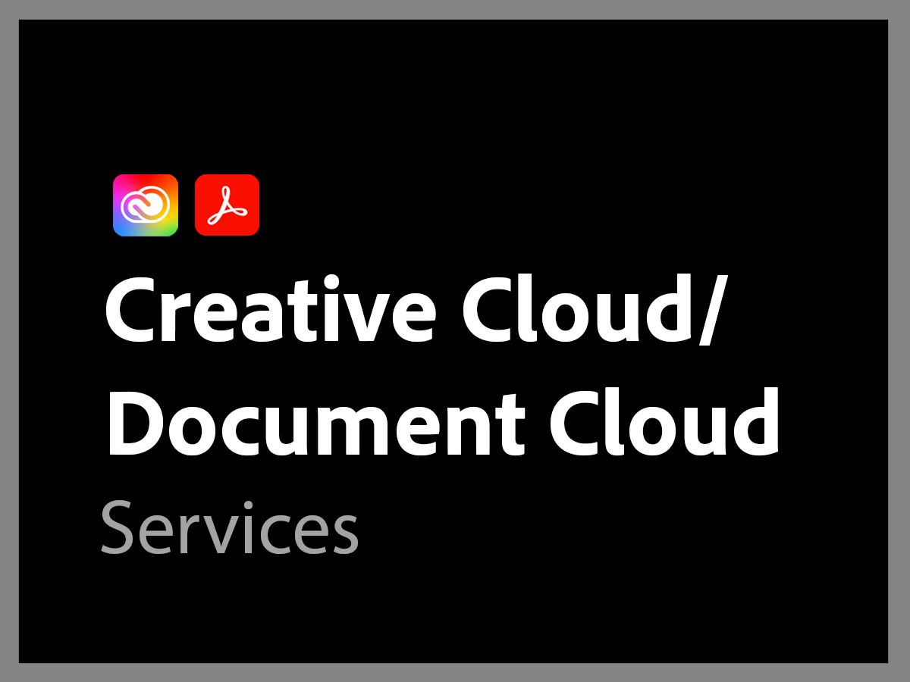

# Overzicht van Adobe-ondersteuning

De organisatie van de Steun van Adobe is geëngageerd aan uw succes. Alle abonnementen omvatten een niveau van steun dat gemakkelijke toegang tot onze hooggekwalificeerde technische middelen voor technische bijstand verleent.

Voor uitgebreidere behoeften bieden wij de diensten van de Steun van Adobe die toegang tot genoemde steunberoeps en zittingen voor pro-actieve begeleiding en de dienstoverzichten omvatten. Hoe complex uw supportbehoeften ook zijn, Adobe biedt de technische en operationele expertise die nodig is om u te helpen optimale prestaties en een optimale waarde van uw Adobe-oplossing te behalen.

<table style="table-layout:fixed">
<tr>
  <td>
    
    

    <a href="dx-overview.md"><strong>Experience Cloud-ondersteuning</strong></a>
    

    
Ondersteuningsopties voor producten van Experience Cloud en Experience Platform

     
  </td>
  <td>
    
    

    <a href="dme-overview.md"><strong>Ondersteuning voor Creative Cloud Enterprise en Document</strong></a>
    

    
Ondersteuningsopties voor producten van Creative Cloud en Document Cloud

     
  </td>
</tr>
</table>
