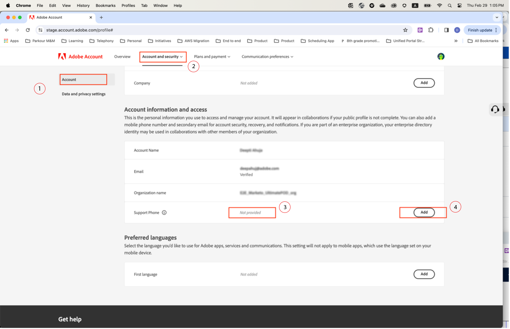

# Geef een telefoonnummer voor voorkeursondersteuning op

Wanneer u een &#39;Admin&#39;-rol krijgt toegewezen, zoals &#39;Product Support Admin&#39;, ontvangt u een e-mail met de kennisgeving dat u &#39;Administrator&#39;-rechten hebt om het exemplaar te beheren waarvoor u beheerdersrechten hebt gekregen.

Het e-mailbericht bevat nu de tekst hieronder in het rood waarin wordt uitgelegd hoe u naar uw accountprofiel gaat en met ons uw voorkeurstelefoonnummer voor ondersteuning kunt delen.

Om uw aangewezen telefoonaantal te specificeren:

1. Klik op de knop **Accountprofiel** koppeling om een nieuw venster te openen voor aanmelden met `account.adobe.com`.

   

1. Doorloop het aanmeldingsproces en landt op het onderstaande scherm `account.adobe.com`.
1. Klik vervolgens op de onderstaande tabbladen Account en Security > Account om het veld Telefoonnummer van ondersteuning weer te geven.
1. Voeg hier een telefoonnummer toe dat we willen gebruiken om u te herkennen voor uw supportbehoeften.

